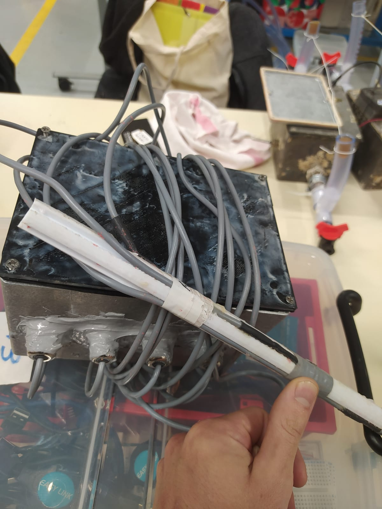

# Bulding tutorial of the MOLONARI 1D datalogger and relay

MOLONARI2024 team

## 1. Prerequisites

### 1.1. Equipment

- Two [Arduino MKR WAN 1310](https://docs.arduino.cc/hardware/mkr-wan-1310) (data collection + LoRa transmission)
- Two [Waterproof Antennas](https://store.arduino.cc/products/dipole-pentaband-waterproof-antenna) (to connect to the MKR WAN 1310)
- One [Adalogger Featherwing SD-RTC Module](https://www.adafruit.com/product/2922) (to connect as per the instructions below)
- Micro USB - USB cables or batteries (to power the boards). Note: USB connection allows for power supply and communication with the computer (for code and Serial port). It also allows charging a battery connected to the MKR WAN.

### 1.2. Software

- [Arduino IDE](https://www.arduino.cc/en/software)
- [Visual Studio Code](https://code.visualstudio.com/) (recommended)

In Arduino IDE, make sure to install the following libraries:

- ``Arduino Low Power`` (Deep sleep mode)
- ``FlashStorage`` (Data storage in flash memory)
- ``LoRa`` (LoRa communication)
- ``RTCLib`` (External real-time clock management)
- ``RTCZero`` (Internal real-time clock management for MKR WAN 1310)
- ``SD`` (SD card communication)
- ``Queue`` (Data packet transfer)
- ``MKRWAN`` (LoRaWAN communication)

## 2. Connections

For the connections, it is highly recommended to do it on a breadboard (in this case, 2 assembled together) to have very clean connections and not have to constantly wonder if your connections are causing the problems.

By *connections* we mean the electrical connections between the *MKR WAN 1310* (A) and the *Adalogger Featherwing* (B) (SD + RTC), as well as with the sensors. For more clarity, you can find the *pinouts* (= pin mappings of a board) at the following links:

- [Pinout MKR WAN 1310](https://docs.arduino.cc/hardware/mkr-wan-1310) → "Pinout +"
- [Pinout Featherwing](https://learn.adafruit.com/adafruit-adalogger-featherwing/pinouts)

It is interesting to note that the pins not used on the Featherwing are useless and especially **connected to nothing**. So you can run cables on the breadboard lines associated with these pins (which are not).

Each step is detailed below, but here is a diagram that summarizes everything:

### 2.1. Power supply part

Make sure the battery power goes well to the *Featherwing*. This means connecting, as indicated on *diagram 1*:

* the grounds (GND). It is recommended to reserve a line of the breadboard for the use of a common ground (this is a common practice that facilitates wiring and its revision). In the case of the first prototype realized, the red line was reserved as ground. 
* the VCC pin (A) to the 3.3V port (B). Since the SD card needs to be connected to the VCC port all the time we recommend to assign a whole line in the bread board where is the *Featherwing* to the VCC.
* the sensors. We assigned one digital port (pin 1) to feed the sensors only when the Arduino is not sleep (when it has to take the measurements), we reserved a whole line for that in the breadboard where the Arduino is.

### 2.2. SD part

Here, there are 4 pairs of pins to connect to ensure communication:

* The chosen CS pin on (A) (we took 5)* to the SDCS pin (B)
* The following 3 pins (they ensure SPI communication) be careful it's very technical:
  * (A) SCK - SCK (B)
  * (A) MOSI - MOSI (B)
  * (A) MISO - MISO (B)

**<u>Note:</u>** The CS pin on (A) is optional, it must in any case match the "`const int CSPin`" appearing in the file [Sensor.ino](../Sensor/Sensor.ino) (see below). Do NOT take pin 6. The reason is simple: it is directly connected to the built-in LED of the board, and it will light up every time you communicate with the SD module, and it will drain the battery.

### 2.3. RTC part

For the RTC, there are 2 wires to connect:

*   (A) SCL - SCL (B)
*   (A) SDA - SDA (B)

### 2.4. Sensors

This part applies to temperature sensors (rod with 4 thermistors). If you use a differential sensor (for pressure) you will need to get information. Otherwise, for the temperature part, the cable output of each sensor consists of 3 parts:

* The yellow cable → ground (GND)
* The blue cable → 3.3V power supply (VCC)
* the white cable → board pin (we took A1, A2, A3, and A4)

**Note:**  
To save energy, we cut off the power to the sensors when not in use, as we mentioned before. To do this, we simply connected the + of the sensor power supply (blue cable) to pin 2 which is connected to the black line in the breadboard, in this way the sensors are only feed when it is necessary.

## 3. The code to insert into the boards.

You will need a *USB - Micro USB* cable connected to a computer with Arduino IDE and the code to insert.  
**Very important:** the main code file (in our case [Sensor.ino](../Sensor/Sensor.ino)) must be in a folder with the **same name** (that's how it is).

### 3.1. Sensor code (in the river)

For the sensor, it's the code [Sensor.ino](../Sensor/Sensor.ino) that needs to be loaded.

Before uploading the code, make sure the pins (CSPin and sensor pins) match what is actually happening, otherwise, the worst thing that can happen to someone doing this kind of thing will happen: the code compiles and it still doesn't work...

Then it's Upload (the button with the arrow). If the Arduino does not appear when you are asked to choose the board while it is properly connected, press the reset button on the Arduino twice. Then, reselect the COM port to the right of the upload button. If after that it still doesn't work: google and good luck :)

In order to better understand the sensor code, you can see the file *2 - Explaining the sensor code* which explains each section of the code and the classes necessary for its operation.

### 3.2. Relay code (on the shore)

It's the same, but with the right code ([Relay.ino](../Relay/Relay.ino)). Simple, right?

## 4. Finalize

*Note: Some instructions in this part are only useful if you want to do a demo. For tests, you can simply connect the boards to a computer via USB, to have a Serial connection. In particular, you can skip putting the electronics in the waterproof box.*

### 4.1 Transmitter side:
Pass the temperature probe cables through the cable glands (unscrew the cover, insert the cables, screw the cover back on for sealing). See the photo below for an idea.  
Put ballast at the bottom of the box to prevent it from floating. Plan at least 2~3 kg.

It should look like this:

Then you need to **delete all files from the SD card** and insert it into the Adalogger. All that's left is to connect the antenna and the battery.  

If everything goes well, the orange LED should light up and then turn off. It lights up as soon as the program starts and turns off when it has successfully initialized. If the LED does not turn off, it is probably due to an SD card problem.  
NB: it is normal for the green LED not to light up when the Arduino is on battery, the manufacturers did this to avoid wasting power.

Put the roof back on and screw it (tightly) for sealing (note in the photo the screws are not screwed in)  

### 4.2 Receiver side:

If you want to do a demo, connect the antenna to the Arduino, and connect the Arduino to a computer via USB. On the computer, open software that will read what the Arduino sends on the Serial port. (For example, the `Serial Monitor` of `Arduino IDE`)  
Here too, if everything goes well the orange LED should light up and then turn off. If it does not turn off, it is probably because there is no software using the Serial port on the computer.  

This year we placed a box on the ground where it should be placed in relay in case we put the whole system in the river ready to take and send data. The arduino must be connected to an antenna and a battery. As proposed improvements for future editions, it is recommended to place a second arduino in the box that is ready to take control in case the first arduino stops communicating with the sensor for any reason.

Additional options:  
- **Curve on Arduino IDE**: If you want the data to appear on a curve, connect `pin 1` to `VCC` (+3V) on the receiving Arduino, and launch the `Serial Plotter` of `Arduino IDE`.

## Heuuu why doesn't it work?

Well... good luck.

* Make sure the connections are good (and the contacts with a multimeter)
* Make sure the Arduino LEDs light up and then turn off. If they do not light up, they have no power, if they do not turn off, the initialization failed. If the sensor initialization never finishes, the SD card is responsible in 99% of cases. If it happens with the relay, it is not connected to a computer, or the computer has no software trying to receive data from the Serial port.
* At first, it is recommended to do as many tests as possible with a computer (which powers the board via USB) with a Serial connection, which allows displaying things in the terminal. It's the equivalent of print() in Python, and it's called `Serial.println()` (the `Serial.print()` does the same thing but without a newline). If you want an avalanche of comments in the console to understand what is happening, we have provided for it in the code. Just uncomment the line `#define DEBUG` at the beginning of [Sensor.ino](../Sensor/Sensor.ino) and [Relay.ino](../Relay/Relay.ino), and re-upload the program to the Arduinos.
* There is a chance that the SD card will cause you problems, it often stops working randomly. Some tips if this happens:
  - Reset the Arduino with the reset button
  - Remove the SD card, blow on it and reinsert it
  - Delete all files from the SD card
  - All of the above at the same time
* It has happened to us several times that in spite of trying all possible solutions, the code would not load in the arduino or the code simply would not run. After trying everything it turned out to be a problem with the cable. Make sure that the cable is working properly first of all!
* If even after checking everything and exorcising by a certified priest it still doesn't work, you always have the solution of quantum enchantment...
