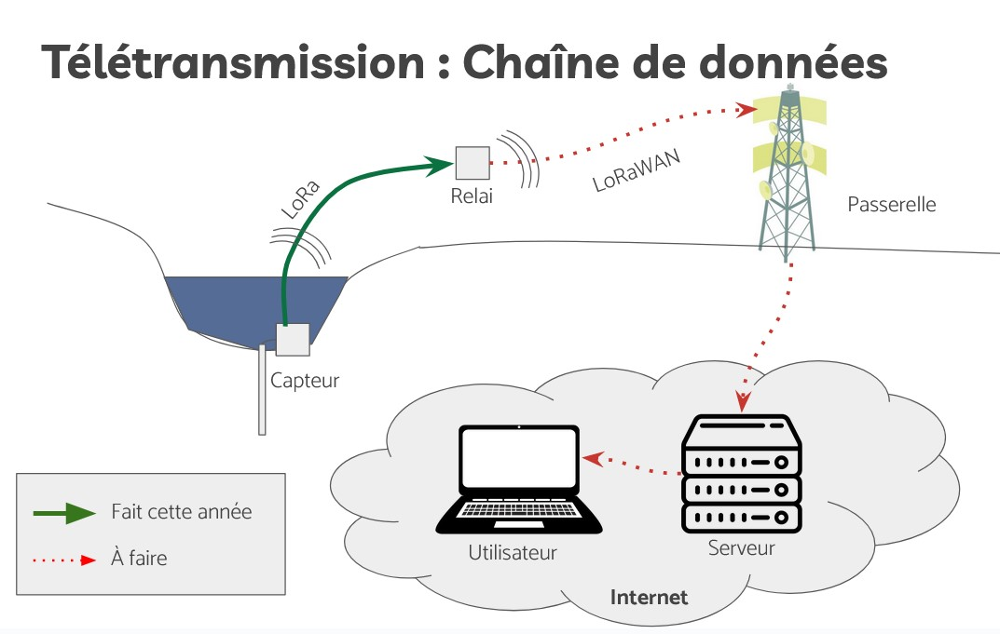

#    MOLONARI1D ecosystem

MOLONARI means MOnitoring LOcal des échanges NAppe-RIvière, which translates in English to LOcal MOnitoring of Stream-aquifer exchanges (LOMOS).

The MOLONARI1D ecosystem is a comprehensive **environmental monitoring solution** for water and heat exchanges in riverbed environments. It provides end-to-end monitoring from hardware deployment to scientific analysis, enabling long-term autonomous data collection in challenging aquatic environments.




## System Architecture

MOLONARI1D implements a **multi-tier monitoring architecture** designed for scalable, autonomous environmental monitoring:

```
Underwater Sensors → Relay → Gateway → Server → Database → Analysis Tools
     (Arduino)       (LoRa)  (LoRaWAN)  (Internet) (SQL)   (Python ML/GUI)
```

**Data Flow Pipeline:**
1. **Field Sensors**: Battery-powered Arduino devices collect temperature/pressure every 15min
2. **Local Communication**: Custom LoRa protocol transmits sensor data to relay daily
3. **Wide Area Network**: LoRaWAN gateway forwards data to internet-connected server
4. **Quality Control**: Server database processes and validates incoming sensor data - backend of Molonaviz
5. **Analysis Interface**: GUI manages devices and launches scientific computing - frontend of Molonaviz
6. **Scientific Inference**: pyheatmy performs Bayesian MCMC inversion for flux estimation

## Core Components

### 🔬 **pyheatmy** - Scientific Computing Engine
**Bayesian inference for hydrological parameter estimation**

- **Bayesian inversion, MCMC based**: Infers physical properties of 1D riverbed columns - multichain MCMC also available
- **Data Integration**: Direct coupling with sensor data streams from monitoring systems
- **Uncertainty Quantification**: Provides parameter estimates with confidence intervals
- **Research Extensions**: Modular architecture supporting experimental features

### 📊 **Molonaviz** - Device Management & Visualization  
**PyQt5-based GUI for operational monitoring**

- **Device Registration**: Laboratory and sampling point hierarchy management
- **Data Pipeline**: Quality control workflows from raw sensor data to analysis-ready datasets
- **Analysis Integration**: Direct launching of pyheatmy inference workflows

**⚠️ Requirements**: Python 3.10+ for Molonaviz, Python 3.9+ for pyheatmy

### 🔧 **Hardware Ecosystem** - Environmental Monitoring Devices
**Arduino-based underwater sensor networks**

- **Sensor Nodes**: Waterproof packages with temperature/pressure sensors
- **Relay Stations**: Data aggregation and LoRaWAN communication
- **Communication Protocols**: Custom LoRa (local) + LoRaWAN (wide-area)
- **Power Management**: 8-12 months autonomous operation

## 🚀 Quick Start

### Repository Structure

```
MOLONARI1D/
├── hardware/                  # Arduino-based monitoring devices
│   ├── sensors/              # Temperature, pressure, and demo sensors
│   ├── relay/               # Data aggregation stations
│   ├── shared/              # Common libraries and protocols
│   ├── tests/               # Hardware validation tests
│   └── docs/                # Hardware documentation
├── pyheatmy/                 # Scientific computing engine
├── Molonaviz/               # Device management GUI
├── data/                    # Sample datasets
└── dataAnalysis/            # Analysis tools and notebooks
```

## Recent Improvements (December 2024)

🚀 **Enhanced Development Workflows**: Comprehensive repository reorganization with team-oriented structure, consolidated shared libraries, and automated CI/CD validation for all components.

📚 **Comprehensive Documentation**: Added 15+ README files for Arduino sketches, complete API documentation (MOLONARI1D_API.md), and integration guides between hardware and software components.

🔧 **Improved Hardware Integration**: Better integration between the original `Device/` structure and new organized `hardware/` directory, with clear migration paths and backward compatibility.

✅ **Quality Assurance**: Fixed CI issues, validated all test suites, and ensured robust development workflows for multi-team collaboration.

### Installation & Setup

**Prerequisites:**
- Python 3.10+ (for Molonaviz) or 3.9+ (for pyheatmy only)
- Arduino IDE 2.x (for hardware development)
- Git with shallow clone support

**1. Clone Repository:**
```bash
git clone --depth=1 https://github.com/flipoyo/MOLONARI1D.git
cd MOLONARI1D
```

**2. Install Python Components:**


Here is a step-by-step guide to install the ecosystem: 
- First install **pyheatmy**, from the **pyheatmy** folder, by running ```pip install -e .```
For more informations on the software, please check the folder.

- Second install **molonaviz**, from the **Molonaviz** folder, by running ```pip install -e .```
For more informations on the software, please check the folder.

You are now set to use the ecosystem. To launch it, you can simply run ```molonaviz``` in a terminal.

**WARNING** For less advanced users, please refer to the end of the section to set-up your environment to at least `python3.10+`

**3. Validate Installation: - untested copilot inserted section**
```bash
# Test pyheatmy
python -c "import pyheatmy; print('pyheatmy ready')"

# Test Molonaviz structure (expected GUI import error in headless mode)
cd Molonaviz/src/
export PYTHONPATH="$PWD:$PYTHONPATH"
python -c "import molonaviz; print('Molonaviz structure validated')"
```

**4. Run Tests: - untested copilot inserted section**
```bash
# Unit tests (~5 seconds)
cd ../../
pytest pyheatmy/ Molonaviz/

# Scientific workflow validation (~85 seconds)
cd pyheatmy/
pytest --nbmake --nbmake-timeout=600 demoPyheatmy.ipynb demo_genData.ipynb
```

### Hardware Setup

**For Arduino Development:**
```bash
cd hardware/
# See hardware/README.md for detailed setup instructions
# Requires Arduino MKR WAN 1310 and associated libraries
```

### Usage Examples

**Scientific Analysis with pyheatmy:**
```python
import pyheatmy

# Load sensor data and run MCMC inference
column = pyheatmy.Column.from_sensor_data('site_data.csv')
results = column.run_inference(n_iterations=10000)

# Extract flux estimates with uncertainty
water_flux = results.get_parameter_distribution('darcy_velocity')
```

**Device Management with Molonaviz:**
```bash
# Launch GUI (requires X11/display)
cd Molonaviz/src/
python -m molonaviz.main
```

**Hardware Programming:**
```bash
cd hardware/sensors/temperature/Sensor/
# Compile and upload to Arduino MKR WAN 1310
arduino-cli compile --fqbn arduino:samd:mkrwan1310 Sensor.ino
arduino-cli upload --fqbn arduino:samd:mkrwan1310 Sensor.ino --port /dev/ttyACM0
```

### Target Audiences

- **🔬 Research Users**: Operate monitoring systems and analyze flux data
- **💻 Software Developers**: Extend Python ecosystem and analysis tools  
- **🔧 Hardware Developers**: Build and deploy sensor networks
- **📡 Protocol Engineers**: Develop communication systems
- **🏭 Fablabs**: Manufacture and deploy monitoring hardware

### Getting Help

- **📖 Documentation**: See component-specific README files
- **🧪 Examples**: Check `data/` and `dataAnalysis/` directories  
- **🐛 Issues**: Open GitHub issues for support and bug reports
- **💬 Community**: Participate in collaborative development

## Warning on Reliability

This version of MOLONARI1D is a development version. Some features are not yet implemented or are incomplete. Some bugs may also appear. We therefore do not guarantee any reliability on the resulting values of the calculations, however the data format will remain constant during their full implementation. Think of this code as a template that will remain persistent when the features are reliable in their results.


## Contributors
MOLONARI1D is a teaching and research project held at Mines Paris - PSL since 2021, under the supervision of Nicolas Flipo, Aurélien Baudin, Agnès Rivière, Thomas Romary, and Fabien Ors.

- Nicolas Flipo supervises the development of the MOLONARI 1D ecosystem. He manages the github repository and the developpers' teams. With Fabien Ors and Pierre Guillou, he is in charge of the source code development either for hardware programming, scientific computing, and IT
- Aurelien Baudin and Agnès Rivière supervise the **monitoring device development** and their **_in situ_ deployment**
- Nicolas Flipo and Thomas Romary supervise the development of **pyheatmy**
- Fabien Ors contributed to the 2021 and 2022 editions by conceptualising **molonaviz**, and since 2024 securizing it
- Since 2024, Pierre Guillou secures the software deployment

The MOLONARI1D project is integrated into the french project [EQUIPEX+ TERRA FORMA](https://www.insu.cnrs.fr/fr/cnrsinfo/terra-forma-un-nouveau-paradigme-pour-lobservation-des-territoires "link to TERRA FORMA") led by CNRS. 

The student contributors are, for **pyheatmy**:
- 2021 Mathis Bourdin & Youri Tchouboukoff
- 2022 Guillaume de Rochefort, Loris Megy, Valentin Alleaume
- 2023 Mattéo Leturcq-Daligaux, Nicolas Matte, Mathis Chevé, Zhan Jing, Dan Maurel
- 2024 Martin Jessenne, Ombline Brunet, Alexandre Noël, Jordy Hurtado Jimenez, Aurélie Reynaud, Antoine Bourel de la Roncière, Colin Drouineau

for **molonaviz**:
- 2021 Sandra Clodion & Charlotte de Mailly Nesle
- 2022 software restarted from scratch by Guillaume Vigne
- 2023 Thibault Lambert

for **hardware programming**:
- 2022 Wissam Karrou, Guillaume Rouy, Pierre Louisot 
- 2023 François Bradesi, Aymeric Cardot, Léopold Gravier, Léo Roux
- 2024 Mohammad Kassem, Zehan Huang, Lucas Brandi, Haidar Yousef, Valeria Vega Valenzuela, Zihan Gu, Yufan Han, Yibing Wang

## Copyright

[](https://opensource.org/licenses/EPL-2.0)

© Contributors to the MOLONARI1D softwares.

*All rights reserved*. This software and the accompanying materials are made available under the terms of the Eclipse Public License (EPL) v2.0 which accompanies this distribution, and is available at http://www.eclipse.org/legal/epl-v20.html.

**pyheatmy** and **molonaviz**  were first released in 2021 under the MIT license.


## Warning on reliability

This version of MOLONARI1D is a development version. Some features are not yet implemented or are incomplete.
Some bugs may also appear. We therefore do not guarantee any reliability on the resulting values of the calculations, however the data format will remain constant during their full implementation. Think of this code as a template that will remain persistent when the features are reliable in their results.


## Get the sources

Due to the large history of commits, cloning the repositroy may need to be performed using "Shallow clone" option:

`git clone --depth=1 https://github.com/flipoyo/MOLONARI1D.git`


## Virtual environments for linux

### 1. **Using `pyenv` to Manage Multiple Versions of Python**

`pyenv` is a convenient tool for installing and managing multiple versions of Python on your Ubuntu system. Installing `pyenv`:

1.1. **Install the necessary dependencies:**

   ```bash
   sudo apt update
   sudo apt install -y make build-essential libssl-dev zlib1g-dev libbz2-dev libreadline-dev libsqlite3-dev wget curl llvm libncurses5-dev xz-utils tk-dev libxml2-dev libxmlsec1-dev libffi-dev liblzma-dev
   ```

1.2. **Install `pyenv`:**

   You can install `pyenv` using the official installation script:

   ```bash
   curl https://pyenv.run | bash
   ```

   Follow the on-screen instructions to add the following lines to your `~/.bashrc` file (or `~/.zshrc` if you use `zsh`):

   ```bash
   export PATH="$HOME/.pyenv/bin:$PATH"
   eval "$(pyenv init --path)"
   eval "$(pyenv init -)"
   eval "$(pyenv virtualenv-init -)"
   ```

   Reload your shell configuration file with `source ~/.bashrc` or open a new terminal.

1.3. **Install a specific version of Python:**

   ```bash
   pyenv install 3.10.12
   ```

   Replace `3.10.12` with the version of Python you want to install.

1.4. **Set the global default Python version:**

   ```bash
   pyenv global 3.10.12
   ```

   To change the Python version for a specific project, navigate to the project directory and use:

   ```bash
   pyenv local 3.10.12
   ```


### 2. **Using Virtual Environments**

To manage project-specific dependencies, you can create a virtual environment with `venv` or `virtualenv`:

```bash
python3 -m venv myenv
source myenv/bin/activate
```

Then, you can install Python packages without affecting other projects.


## Virtual environments for windows

Use anaconda, download it install it.

open the anaconda prompt terminal in windows. Install git for anaconda:

Install gitlab for conda:

```bash
> conda install -c anaconda git
```

And create a virtual environment

```bash
> conda create --name py3.11.4 -c anaconda python=3.11.4
```

Activate the virtual environment

```bash
> conda activate py3.11.4
```

Run the MOLONARI installation process from there. You can launch molonaviz from there.

For developpers, run code . from there to be sure to be in the proper environment

Deactivate the virtual environment 


```bash
> conda deactivate
```


 

