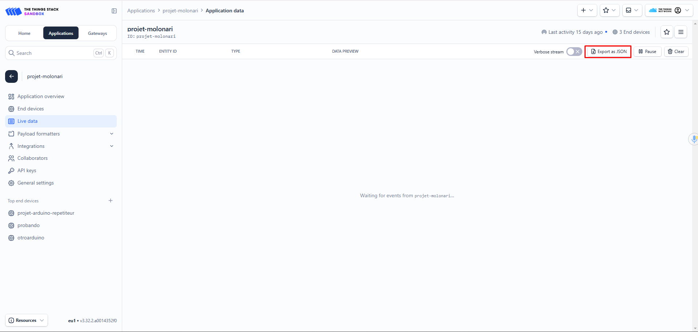

# Using the server

Once the Server and Gateway are configured, we must start implementing and using communication via LoRaWAN to obtain the information sent from the Relay to the server through the Gateway.

# Testing the Server

We can start testing the communication between the server and the Gateway.

To test that the information is correctly reaching the server, we can use the code found in the "Tests Codes" folder, within "testArduinoLoRaWAN":

- DevEUI allows us to obtain this parameter from the specific Arduino we are using.
- testArduinoLoRaWAN allows us to test the communication between the Relay and the server by sending a list of data that simulates the data that will actually come from the sensor in the river.

# Server and Relay Communication

The communication established between the server and the Relay was developed up to the testing phase. For the next year, the goal is to develop a code that allows:

- Establishing and then terminating the communication
- Sending a message from the server to the sensor in the river to confirm the receipt of the information, which would allow deleting the information from the SD card to avoid storing information already received by our server.

# Take the data from the server

With the current configuration, the information reaches the server, and we can view it from the "Live Data" section in the application we created in The Things Stack Sandbox.

If we want, once all the information has reached the server, we can manually download it by clicking on "Export as JSON."

Therefore, to continue the work, one objective would be to download this information automatically, so we don't have to do it manually after each communication. We propose possible alternatives to investigate. One option is to use the "Integrations" available on the server:

As a first option, we could use MQTT.

As a second option, we could use webhooks and Python together, where the general idea would be to create a server with Local Python, use Ngrok to make it public on the internet, then enable the necessary ports and IP with Riaz SYED to access it, and see how to configure it so that the information arrives.

If instead of using a local server created with Python, we should look for some free and online server that allows us to store our information there. The Things Stack would allow this, but credit card information must be provided.

