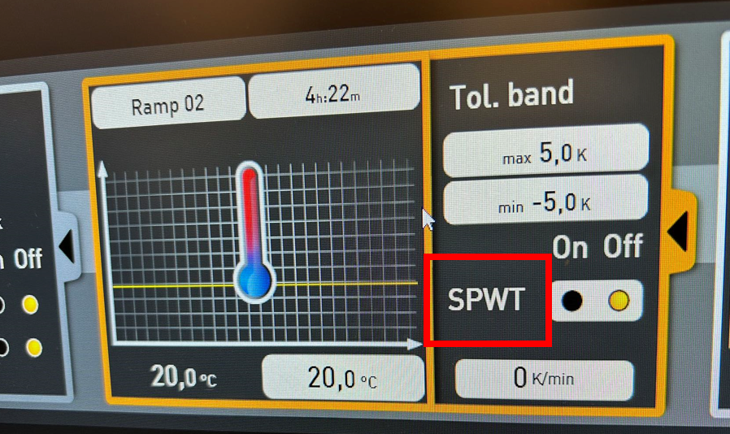
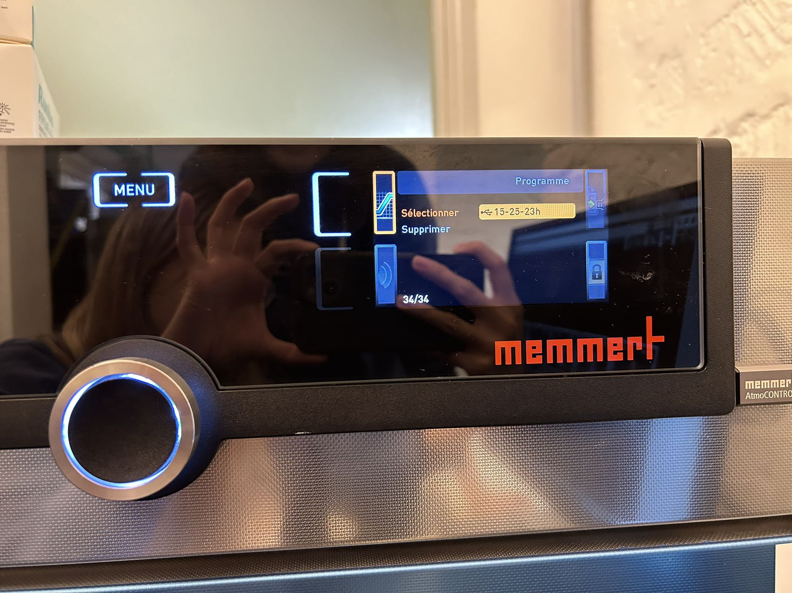

# Climate Chamber Userguide

---

## 1. Introduction
With AtmoCONTROL, you can graphically create, modify, and save programs with various parameters on the computer and transfer these programs to the climate chamber using a USB disk.

## 2. Working with AtmoCONTROL
Since we use the computer in zoom V003 at MINES, the following operations are based on the assumption that the AtmoCONTROL software has been installed and the AtmoCONTROL FDA device license has been successfully set up.

### 2.1 Starting AtmoCONTROL
First, unlock the computer using the MINES email address. The AtmoCONTROL program is available on the desktop (or in the Start menu). It does not allow multiple Windows users to operate on the same computer in parallel. **The student account may have limited usage rights, such as being unable to set temperature parameters.** (Aurélien mentioned that we can use his account temporarily, and he will apply for permissions for us.)

### 2.2 Program Interface

1 Menu bar 
2 Toolbar 
3 Status bar 
4 Signature bar
5 Show/hide status bar
6 Editor, simulation and protocol window 
7 Programming mode switch

#### 2.2.1 Menu bar

#### 2.2.2 Toolbar

#### 2.2.3 Status bar
The status bar gives an overview of the appliances logged on to AtmoCONTROL. Appliances can be added and removed again.

If the appliance is connected to the computer via Ethernet and it has already been logged on once, it is automatically recognised and the current operating state (temperature, alarms) is displayed.

Look at this exemple. (1)An appliance of type ICO50; (2) named “Laboratory”; (3) by the user, is registered via Ethernet; 
(4) current operating status in AtmoCONTROL.

### 2.3 Program
In the Editor window, programs can be created: sequences of various parameters (e.g. temperature, pressure and humidity), which the appliance then implements from a definable point in time.

To be able to create a program in AtmoCONTROL, the appliance which is to perform the program must be listed in the status bar and selected. The appliance can, but does not have to, be connected to the computer via the network. 

Select the appliance that will later perform the program by clicking on it in the status bar. An icon bar with the available parameters for this appliance is shown. Additionally, one or two editor threads are displayed, depending on the appliance. The program sequence is determined on these. Two editor threads are always shown for appliances with humidity or pressure control (3 and 4), and one editor thread for all others.

**Bear in mind that the two editor threads are not synchronised.** This means that a specific X position on one thread does not match the same position on the other thread in time. If you want to see the parameter values for a specific point in time, you must change to the simulation mode. While creating the program, you can display the prospective progression of all parameters as a diagram at any time. To do this, click on "Simulation" (see 5 in the image of the part 2.2)

#### 2.3.1 Create a program

**To create a program, just drag the individual parameter icons onto the editor thread one after another in the desired order**, while holding down the left mouse button. It's easy! To remove a parameter icon from an editor thread, select it and, with the mouse button depressed, move it to the recycle bin symbol on the lower right. 

#### 2.3.2 Parameters
If a parameter icon is clicked on an editor thread, it is displayed with an orange frame. The adjustable values – in the example, the ramp name, the duration and the temperature – have a grey background. 

For simulations with constant parameters, 1 represents the duration and 2 the parameter value. In the window on the right that can be displayed and folded, you can edit the tolerance band. We usually set it to the minimum value. Below it is the indicator light on the climate chamber, it is suggested to turn the safe indicator "on".
\

For time-varying parameters, the only difference is that the right window shows SPWT, which means the setpoint wait. If this is “on”, the program sequence is not continued before the setpoint value is reached, even if the set time has already expired. If this is “off”, the program sequence is continued after the set time has expired, irrespective of whether the setpoint value was reached or not. 

It is worth mentioning that for unknown reasons, we found that if the value of the first stable temperature is not set, the subsequent temperatures will automatically start from 20℃. Therefore, it is recommended to set a stable temperature of at least 5 minutes.

These are some other available parameters in the icon bar. Take the sinus curve as an exemple, we usually use an ascending straight line, a straight line parallel to the x-axis, and a descending straight line to simulate it.

#### 2.3.3 Saving
Here we only introduce the way to transfer a program via USB. Click Program -- Export to USB drive. The program is saved on the USB storage medium connected. Then connect the USB data medium to the appliance which is to run the program.

#### 2.3.4 Loading and running the program
A brief introduction to the climate chamber:

1 Touch to select
2 Return to the main menu
3 You can either turn it to select or press the middle to decide
4 USB

To load the program, you should first touch the "MENU" to go into the "PROG". Then turn the button 3 and press to select your program exported. Once you have selected it, turn the button 3 and press the middle to run it. It's over! Just wait.

The above user guide is not complete. If you have other needs, please refer to https://www.memmert.be/wp-content/uploads/2019/10/AtmoCONTROL-.pdf

## 3. Parameters to simulate a day
We use the function $\theta=\theta_0+\theta_\text{amp}\sin{\left(\frac{2\pi}{24\cdot3600}t\right)}$ to represent the way of daily temperature change in a region, with $a$ half of the daily temperature change and $b$ the average temperature of a day. Sadly, the AtmoControl software does not provide sinusoidal commands, so we have to approximate a sinewave with segments. Moreover, the software only allows for integer temperature inputs.

- The `AtmoCONTROL_command_generation` notebook can generate ramps for any function and any number of segments. This method is optimal because it minimizes the quadratic error between the original signal and the segmentized signal. However, you need to manually set each individual ramp in the software, so a lot of points require a longer configuration time. 

- Another way of approximating the signal with a minimal number of points would be a trapezoide conserving the energy of the signal.  This results in a less-precise command, but a smaller configuration time on the software. We calculated the rising/decreasing durations to be **07:38:22** long and the stable durations to be **04:21:38**.

