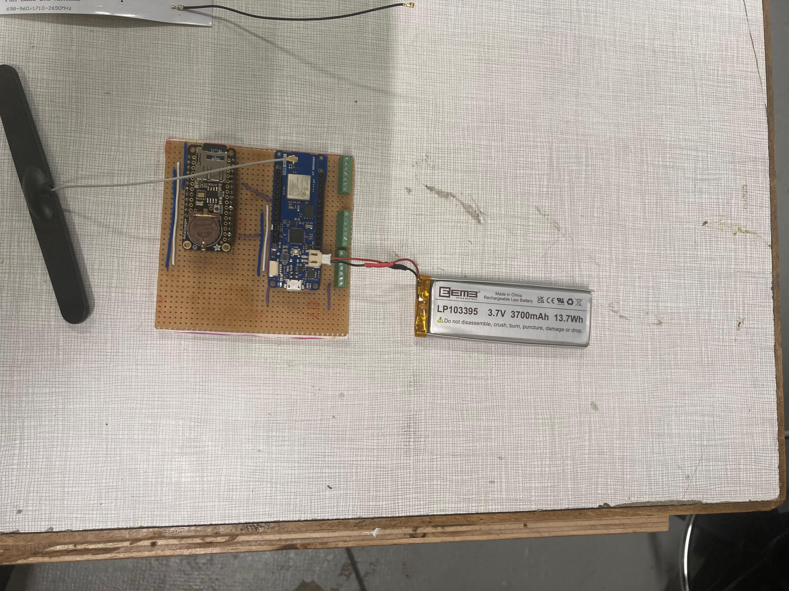
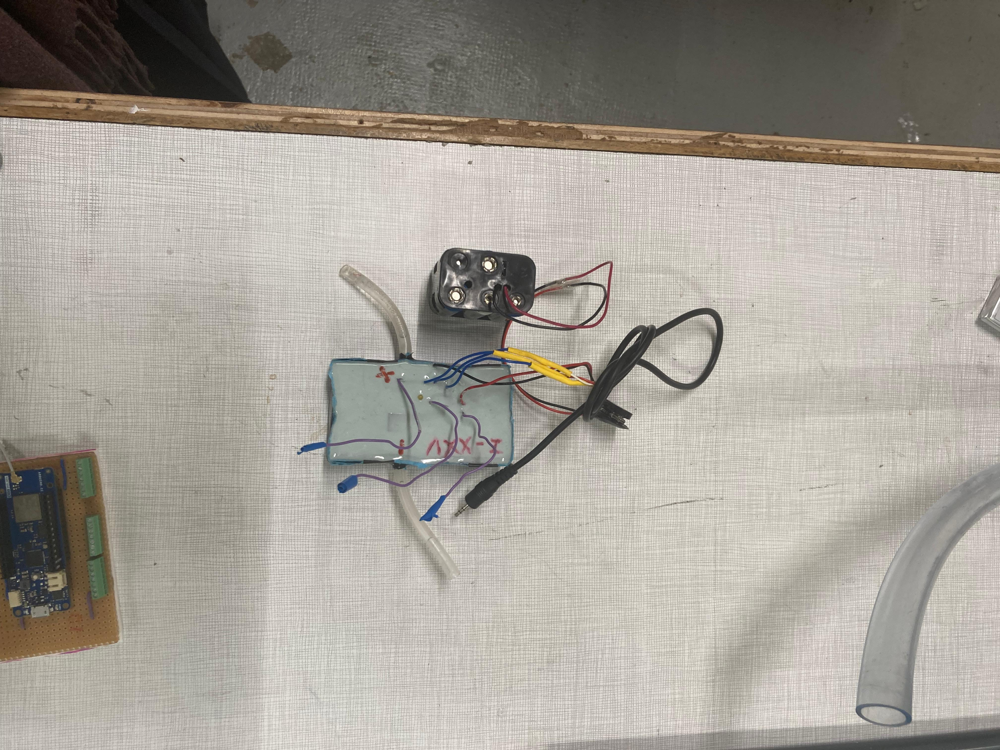

# Description of the complete MOLONARI1D System

## In the riverbed
### Metal Box with weight, seal and cover

 

 

### Electronic circuit with battery and waterproof antenna

### Plastic hosepipe

### Shaft 

### 5 Temperature Sensors

### Pressure Sensor 

### All together

## On the riverbank

### Electronic circuit with battery and antenna

