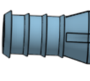

# Shaft design V1.1

**Purpose :**
Improving the system’s shaft by combining the temperature and the pressure systems : from the previous (with 6 Temperature sensors), we change for one with 4 temperature sensors and the pressure sensor. To do so, we reduce the shafts’s length (80 cm → 40 cm), we adapt the positions of the sensors, and we make a hole in the center so as to let the water enter from below to the top of the shaft, connected to the box where the pression captor will be.

**New design :** The new design consists of three parts : 

|   | The shaft itself in which 4 holes are carved in order to place the thermometers and their cables. The sensors are respectively 10, 20, 30, and 40 cm deep from the beginning of the shaft (The 33 mm of each sensor are included in those depths). Each spot is 33 mm long and allows the placement of a 3 mm radius sensor. |
|----------------------------------|------------------------------------|
|     | A set of 4 triplets of conic holes are placed at the bottom, at the same height as the deepest thermometer, in order to let water enter the shaft to measure the difference in pressure between the atmosphere and the bottom of the shaft. The external diameter of each hole is 0.3 mm, which should ensure parasites cannot colonize the shaft for the duration of the measurements. The conical shape of the hole is chosen to minimize the hydraulic charge error due to the size of the external holes.   |
|----------------------------------|------------------------------------|
|   | At the top of the shaft, a fluted connector allows the pipe to be connected to the shaft. In order to ensure there is no loss in hydraulic load between the shaft and the sensors, it is necessary to ensure maximal watertightness when it comes to this connection (as well as the material used to make the shaft). Resin should be added after printing to ensure full waterproofness.      |
|----------------------------------|------------------------------------|

_Before all things_, measurements and testing should be done to ensure that the error on hydraulic loss is small enough to be used for our purpose, and that thermal sensors hold well enough on the shaft. 

**Constraints :** Many constraints needed to be thought about : 
Plastic barbed fittings are economical and suitable for low pressure applications.
Inside and outside diameter : Our shaft needs to be inserted in the river’s bed after we dig a whole in the ground. The whole is made with a metal bar which diameter is 28cm. This means our shaft’s diameter needs to be lower. However, in order to minimise the surface tension between the water and the shafts, the inside diameter of the shafts needs not to be too low. The calculation gives, for a gain of charge of 0.01m a minimum radius of 5 mm. With 12 mm for an inside diameter we insure a precision at 0.01m in the charge measure with the pression sensor.
According to https://www.beswick.com/resources/what-they-didnt-teach-you-about-fittings-in-engineering-school/, the best shape for a plastic component to maximise friction and maximise waterproofness is the sawtooth profile. 
With a thickness of 3mm and the application of resin on the material, we believe that the component will be waterproof enough.

**Method, piece by piece**

+ **The shaft**

First of all, we design a cylinder : height = 40 mm, diameter = 24 mm. Then we remove an internal cylinder : height = 40 mm, diameter = 12 mm. 
The next step is to extrude the material where the temperature captors will be (the cable and the piezoelectric thermo sensor). To do so, we sketch two rectangles, both tangent to the circle (the base of the external cylinder) and the smaller included in the larger one. We construct three other pairs of rectangles symmetrically separated by θ = π/2 ; π ; 3π/2.
The first (4.2 mm x 4 mm) corresponds to the cable and thus will be extruded over 100 mm, 200 mm, 300 mm and 400 mm. The second (5 mm x 6 mm) corresponds to the head of the sensor. We’ll extrude it across 33 mm with an offset of 67 mm (for the sensor at 10mm), 167 mm, 267 mm, 367 mm.
We end the shaft with a round shape :)

|   |    |
|----------------------------------|------------------------------------|

