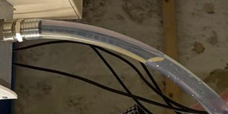
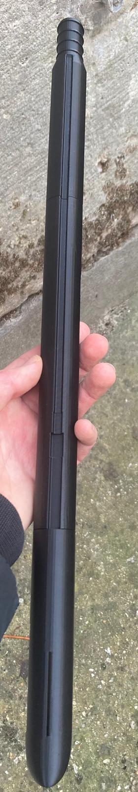
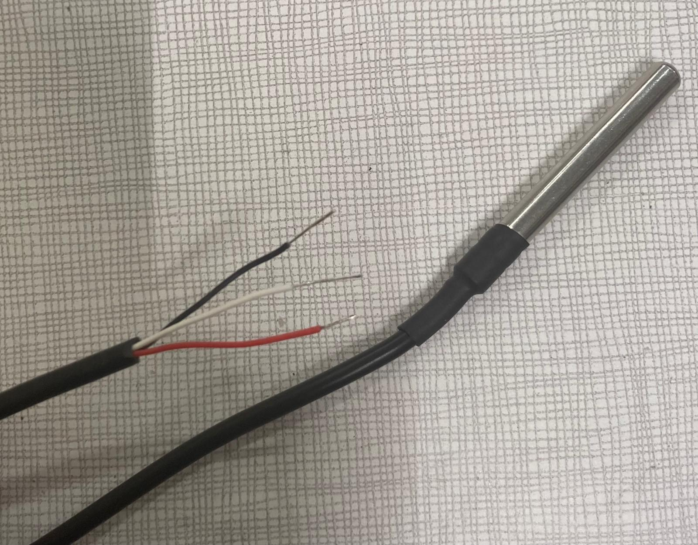
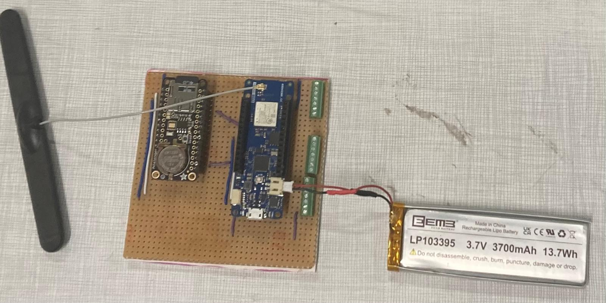
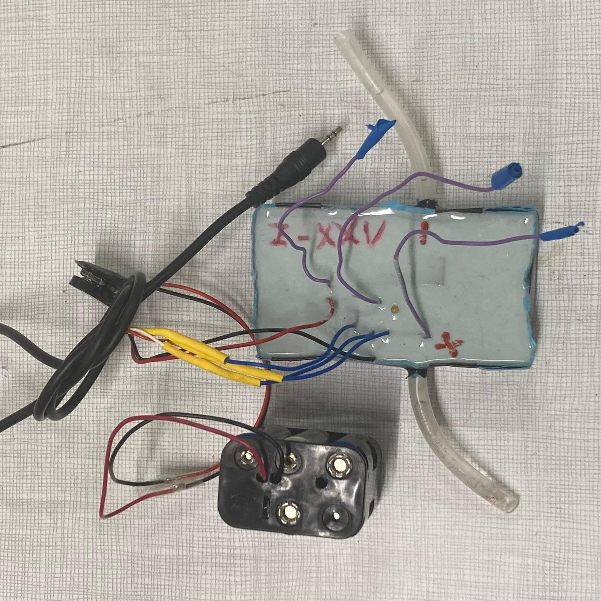
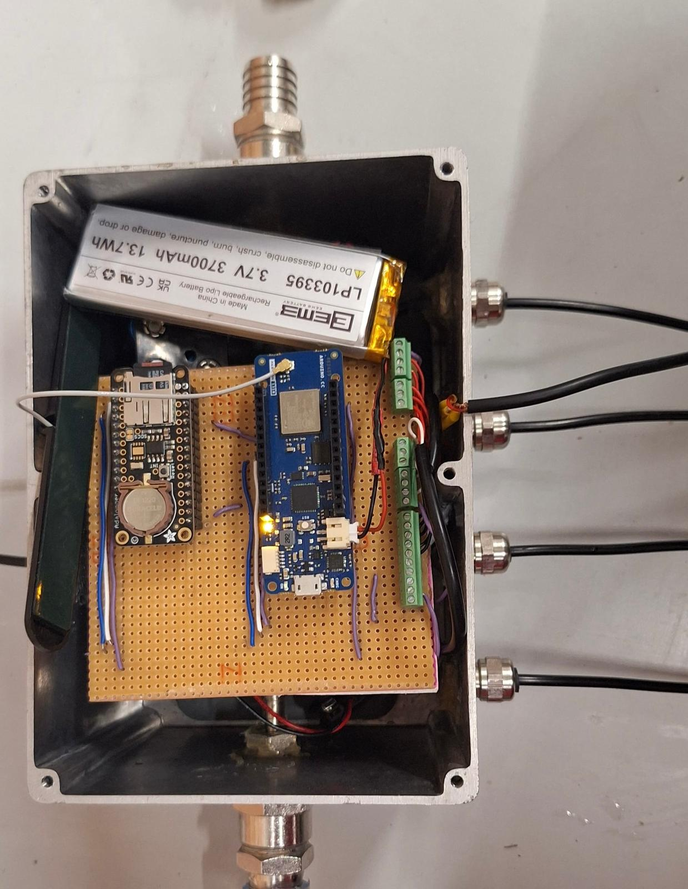
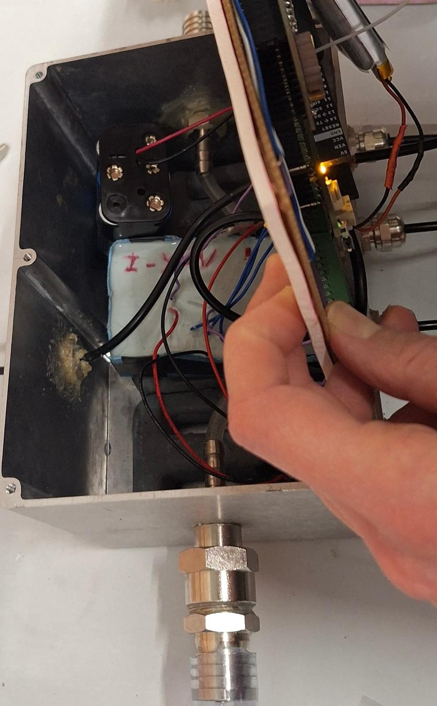
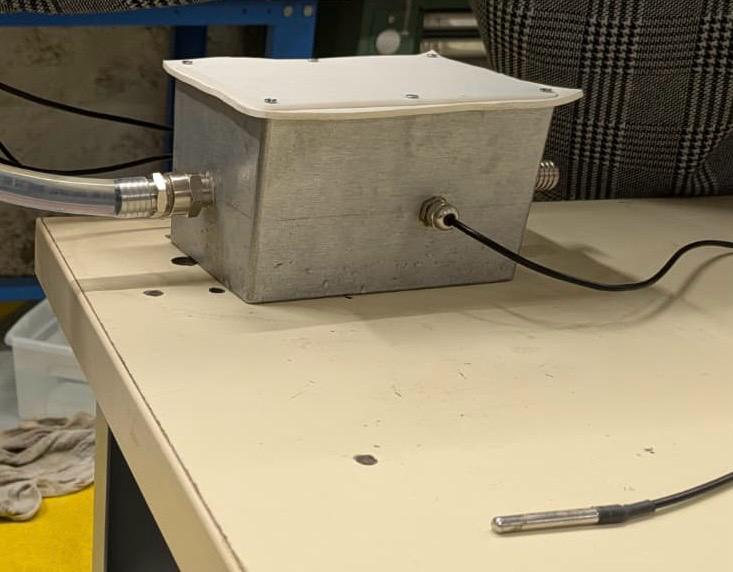
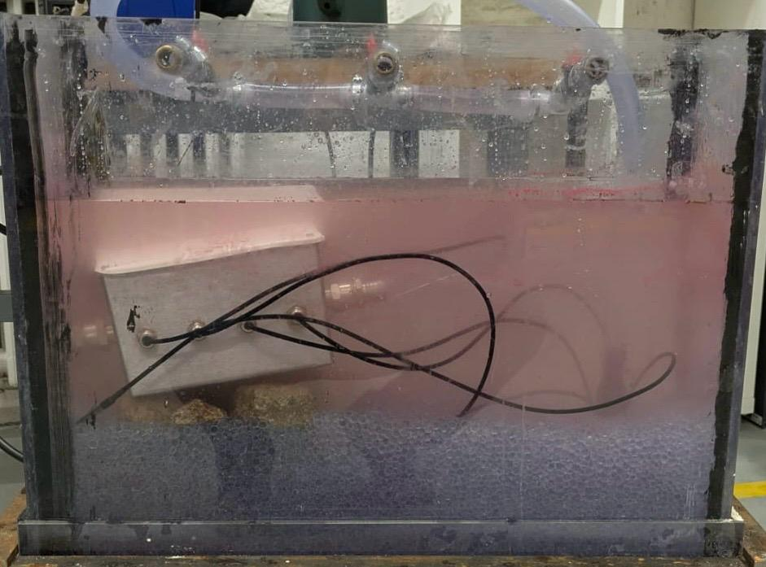
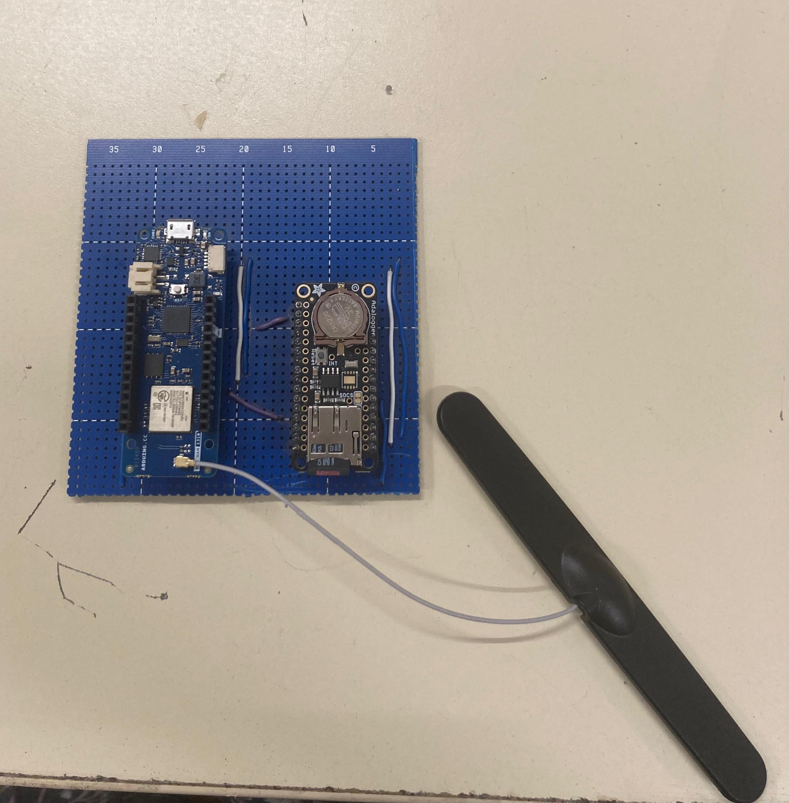

# V2 Hardware Specifications

This directory contains the hardware specifications and designs for the version of MOLONARI1D monitoring devices (v2) developed by the 2025 team.

## Contents 

- **sensors/**: Specifications related to the pressure and temperature sensors
- **relay/**: Specifications of the relay
- **gateway/**: All the specifications related to the gateway
- **costs/**: Documents related to the costs audit
- **electronic connexion/**: Specifications of the electronic circuits (Arduino+Adalogger) used for the telecommunication and the taking of measurements 

## Overview of the complete MOLONARI1D System

## In the riverbed
### Metal Box with weight, seal and cover

 

 

### Plastic hosepipe

It connects the shaft to the metal box.

### Shaft 

### 5 Temperature Sensors

### Electronic circuit with battery and waterproof antenna

It is inside the metal box.

### Pressure Sensor 

It is inside the metal box. 

### All components together

Complete MOLONARI1D System tested in laboratory

## On the riverbank

### Electronic circuit with battery and antenna

