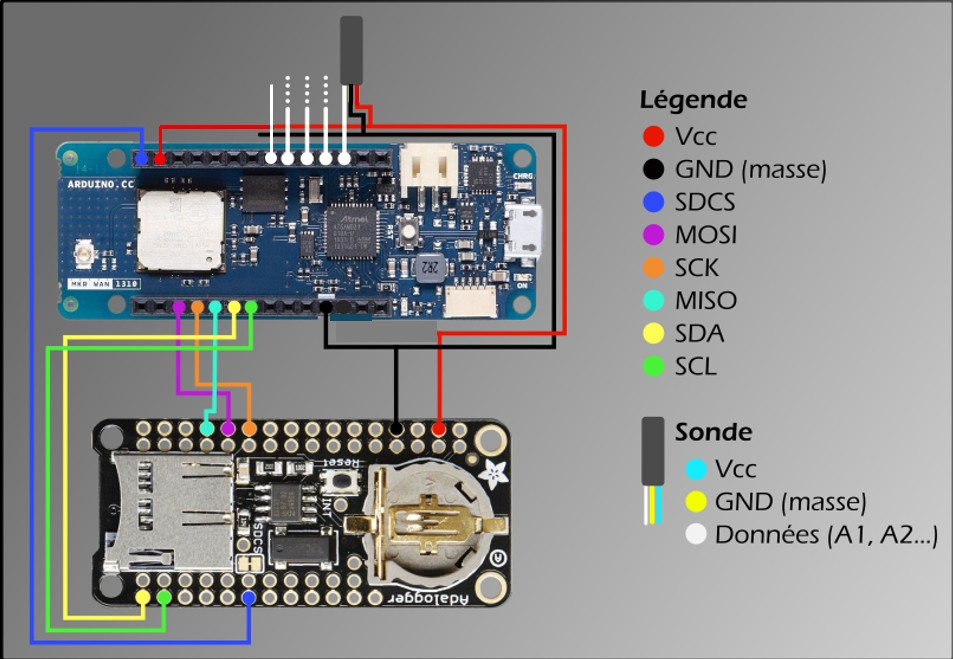
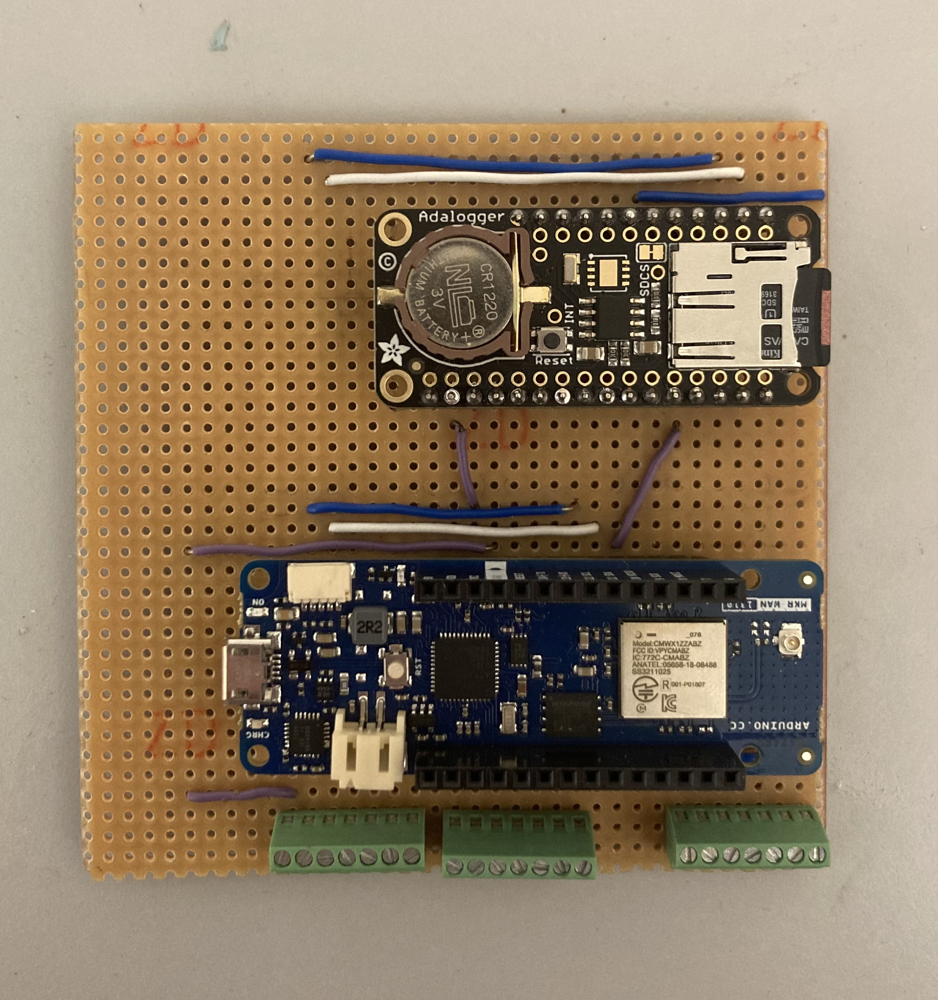
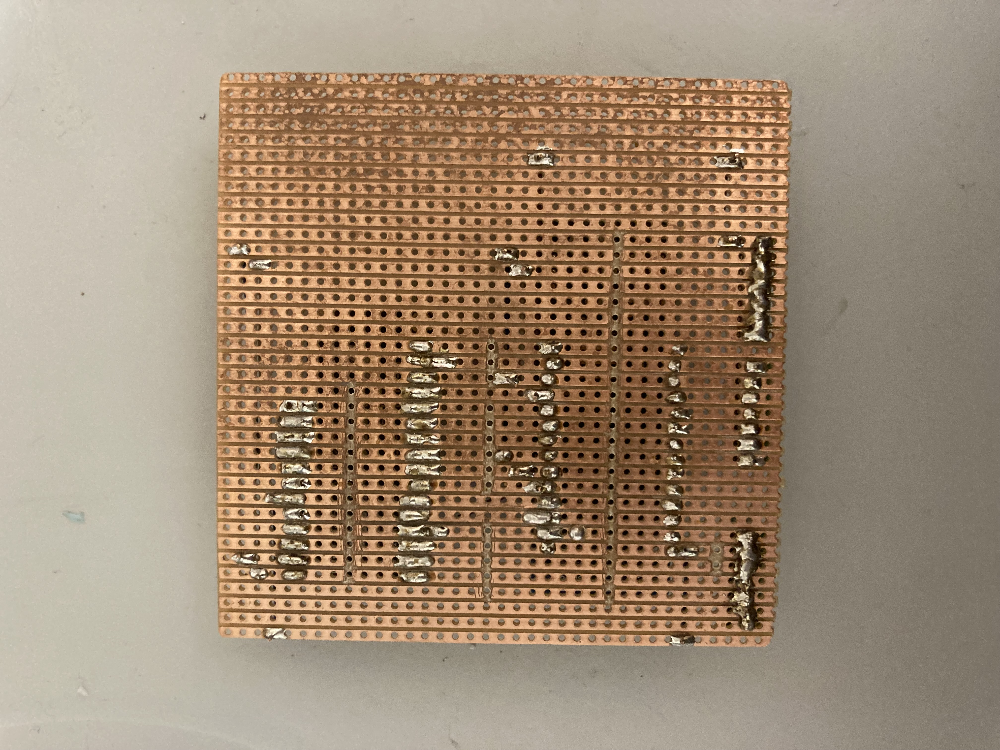
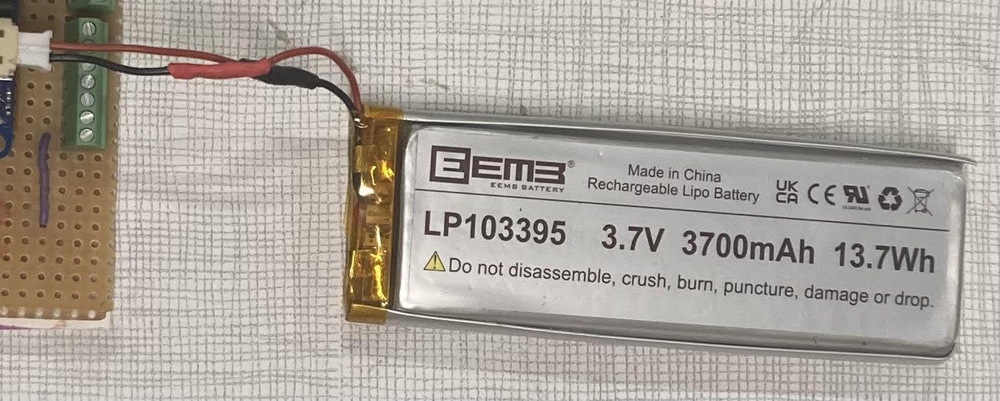
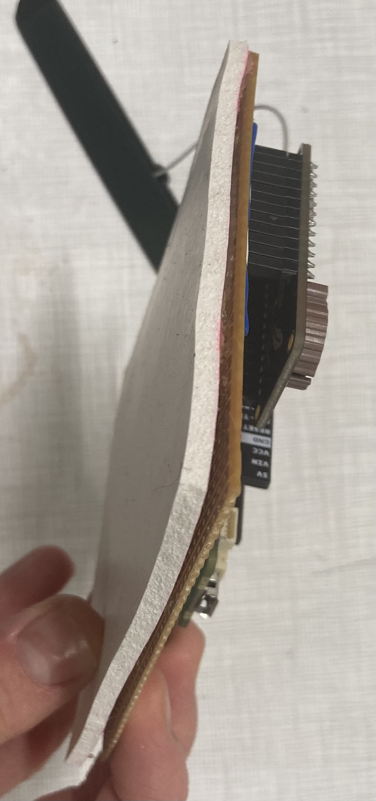
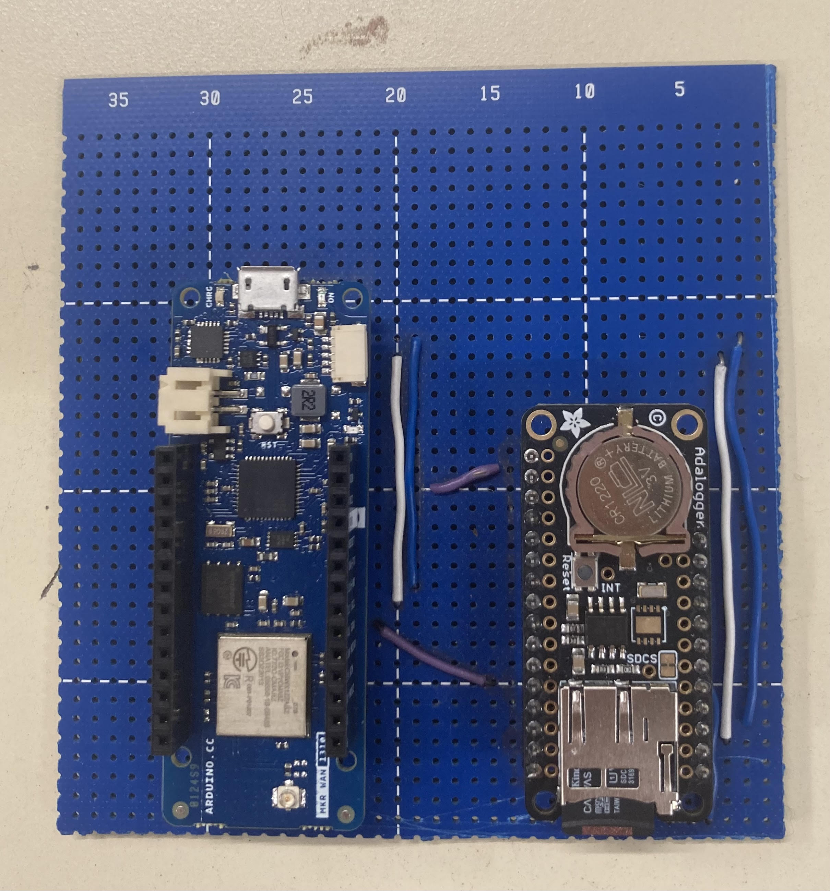
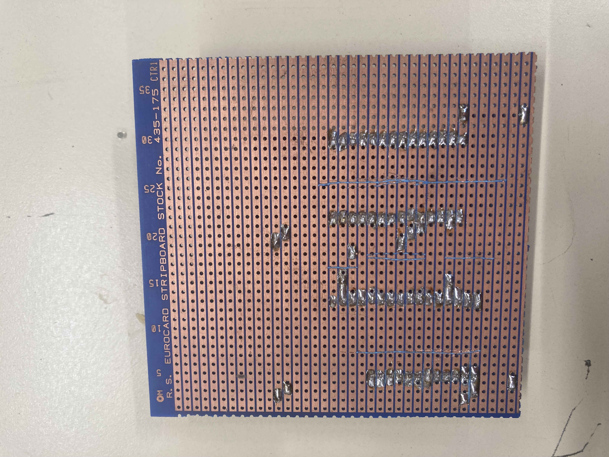

# Bulding tutorial of the MOLONARI 1D electronic circuit

__based on the work of the MOLONARI2024 team - changes made by the MOLONARI2025 team__

## Sensors' electronic circuit

### 1. Equipment

- One [Arduino MKR WAN 1310](https://docs.arduino.cc/hardware/mkr-wan-1310) (data collection + LoRa transmission)
- One [Adalogger Featherwing SD-RTC Module](https://www.adafruit.com/product/2922) (to connect as per the instructions below - see section 2. Connections)
- One [Waterproof Antenna](https://store.arduino.cc/products/dipole-pentaband-waterproof-antenna) (to connect to the MKR WAN 1310)
- Micro USB - USB cables or batteries (to power the boards). Note: USB connection allows for power supply and communication with the computer (for code and Serial port). It also allows charging a battery connected to the MKR WAN.

### 2. Connections

For the connections, two functionnal sensors' electronic circuits were soldered by the MOLONARI2025 team. This section is useful in order to solder more electronic circuits. 

By *connections* we mean the electrical connections between the *MKR WAN 1310* (A) and the *Adalogger Featherwing* (B) (SD + RTC), as well as with the sensors. For more clarity, you can find the *pinouts* (= pin mappings of a board) at the following links:

- [Pinout MKR WAN 1310](https://docs.arduino.cc/hardware/mkr-wan-1310) → "Pinout +"
- [Pinout Featherwing](https://learn.adafruit.com/adafruit-adalogger-featherwing/pinouts)

It is interesting to note that the pins not used on the Featherwing are useless and especially **connected to nothing**. So you can run cables on the breadboard lines associated with these pins (which are not).

Each step is detailed below, but here is a diagram that summarizes everything:

**NB** : the sonde's description on the right bottom of the diagram wasn't updated: the wires coming out of it are red, black and white as on the diagram. Please note that this correspond to a temperature sensor. For the pressure sensor, you will have to check on the pressure sensor's own circuit yourself.

For a detailed diagram of how to solder the electronic circuit, please see the document 'electronic connexion\Electronic circuit soldering diagram.pdf'.

#### 2.1. Power supply part

Make sure the battery power goes well to the *Featherwing*. This means connecting, as indicated on *diagram 1*:

* the grounds (GND). It is recommended to reserve a line of the breadboard for the use of a common ground (this is a common practice that facilitates wiring and its revision). In the case of the first prototype realized, the red line was reserved as ground. 
* the VCC pin (A) to the 3.3V port (B). Since the SD card needs to be connected to the VCC port all the time we recommend to assign a whole line in the bread board where is the *Featherwing* to the VCC.
* the sensors. We assigned one digital port (pin 1) to feed the sensors only when the Arduino is not sleep (when it has to take the measurements), we reserved a whole line for that in the breadboard where the Arduino is.

#### 2.2. SD part

Here, there are 4 pairs of pins to connect to ensure communication:

* The chosen CS pin on (A) (we took 5)* to the SDCS pin (B)
* The following 3 pins (they ensure SPI communication) be careful it's very technical:
  * (A) SCK - SCK (B)
  * (A) MOSI - MOSI (B)
  * (A) MISO - MISO (B)

**<u>Note:</u>** The CS pin on (A) is optional, it must in any case match the "`const int CSPin`" appearing in the file [Sensor.ino](../Sensor/Sensor.ino) (see below). Do NOT take pin 6. The reason is simple: it is directly connected to the built-in LED of the board, and it will light up every time you communicate with the SD module, and it will drain the battery.

#### 2.3. RTC part

For the RTC, there are 2 wires to connect:

*   (A) SCL - SCL (B)
*   (A) SDA - SDA (B)

#### 2.4. Sensors

The sensors are connected to the circuit through the blockers, the green components on the edge of the circuit. 

For the temperature sensors (in total 5 thermistors), the cable output of each sensor consists of 3 parts:

* The black cable → ground (GND)
* The red cable → 3.3V power supply (digital pin ~4)
* the white cable → board pin (analog pins like A0, A1...)

For the differential pressure sensor there are 3 wires that need to be connected to the ground (GND), the 3.3V power supply (digital pin ~4) and an analog pin (like A5 for example). The wire wich is on the same line as the black wire from the 9V battery is connected to the ground (GND), the one sharing the same line as the red wire from the 9V battery is connected to the power supply and the last wire is connected to an analog pin. 

**Note:**  
The power is delivered to the sensors through a digital pin (~4) in order to save energy. In did this pin is controlled by the firmware code and so it delivers current from time to time, just when the sensors have to take a measurement, ie the sensors are only feed when it is necessary.

Here is a picture of the sensor's electronic circuit : 

Following is a picture of the back of the circuit, that could be helpful for the soldering :

### 3. Energy 

In both circuits, the Arduino card is powered by a 3.7V Lithium Battery (LP103395). The direction of the battery's threads had to be switched in order to match with the orientation within the Arduino card, for the battery to work with the card. This was done by cutting the wires and soldering them again, using heat-shrinkable tubings. 

See below a picture of the battery : 

The differential pressure sensor is powered by the Arduino card ans also by a 9V battery, either with 6 batteries of 1.5V each or by a unique 9V battery, which is used to power the Wheatstone bridge within the pressure sensor's own electronic circuit. 

## 4. The code to insert into the circuits.

For all information regarding the code, consult the 'firmware/mains_ino/' folder.

## 5. Finalize 

When the circuit is ready, put silicon on its back and glue on it a seal, in order to protect the circuit from water and avoid short circuits due to the metal of the box in which the circuit has to be put. 

## Relay's electronic circuit

The electronic circuit for the relay is the same as for the sensors with one small difference, it doesn't have the blockers, those green components that are used to connect the sensors to the circuit. Because no sensors are connected to the relay's electronic circuit, neither does it need the wires connecting the ground (GND) to the green blocker. 

This circuit only has the connections between the Arduino card and the Adalogger. 

Here is a picture of the relay's electronic circuit : 

Following is a picture of the back of the circuit, that could be helpful for the soldering :

