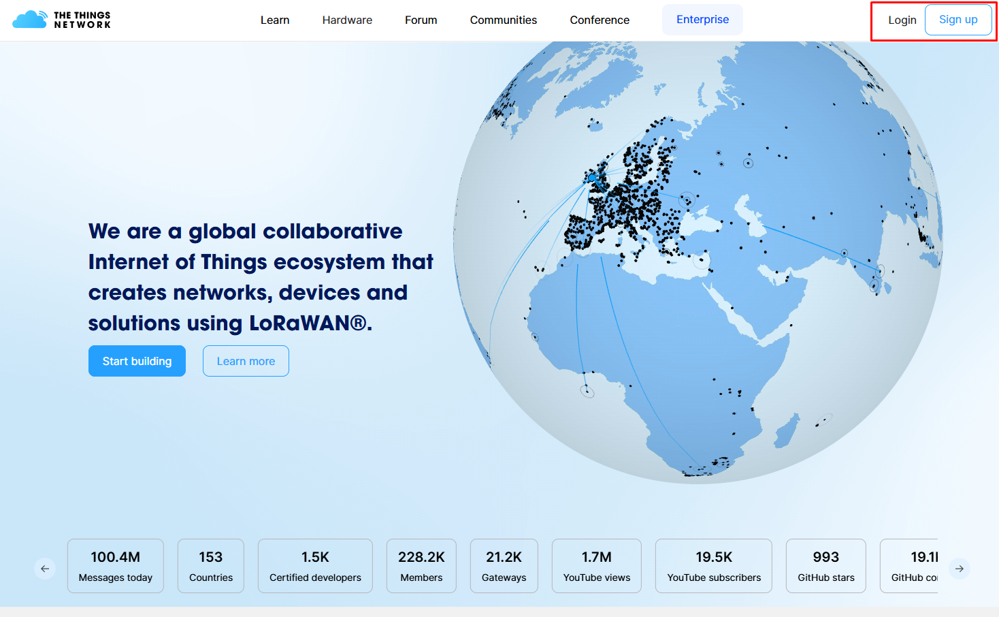
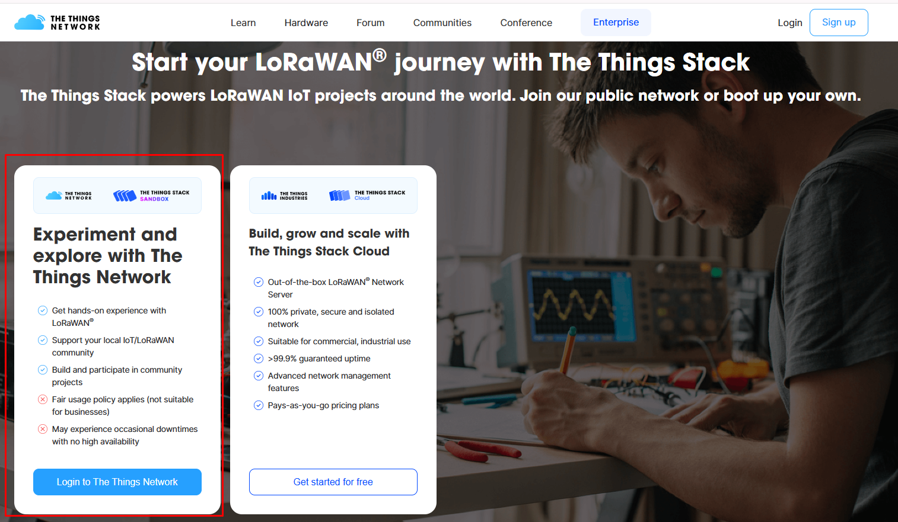

# Server - The Things Stack SANDBOX

## Server Configuration

### Create a TTN account

First, what we need to do is create an account on The Things Stack Network, for this we will enter the following link:

https://www.thethingsnetwork.org/

And in the upper right corner, click on "Login".

Then, we choose the option "Login to The Things Network", and there we create an account.

Once the account is created, we must go to the upper right margin where the name we gave to the account appears, click, and choose the "Console" option. 

There, within the "Existing Clusters" we choose: Europe1

Only here can we start configuring the devices, applications, and Gateway within the Server.

### Create the aplication

The first thing we will do is create an application, for this, on the left side we will see three options: Home, Applications, Gateways.

Clicking on "Applications" and then on the "Add application" button.

We will give the application a name, the one we like the most (for example: "Molonari-Project") and to finish click on "Create application".

### Register the End Devices (the arduinos)

Once the application is created, within it we must register the "End devices", which in our case will be the Arduino that plays the role of the Relay. For this, in the right column, we will find the "End Devices" section, click there, and then on "Register End Device".

Once inside, we will choose the option "Enter end device specifics manually". And in the options they give us, we will put:

- Frequency plan: Europe 863-870 MHz (SF9 for RX2 - recommended)
- LoRaWAN version: LoRaWAN Specification 1.0.3

Then, within the "Provisioning information" section:

- JoinEUI: 00 00 00 00 00 00 00 00
- DevEUI: the value obtained by using the "DevEUI" code (found in the "Test Codes" folder, inside "testArduinoLoRaWAN") on the Arduino that will be our Relay.
- AppKey: we will generate it by clicking on "Generate"
- End device ID: we will give it the name we want (for example: Molonari-relay)

We will finish by pressing "Register end device".

It is IMPORTANT to emphasize here that the values of JoinEUI, AppKey, and DevEUI will be used in the Relay code to establish a connection with the server, so they must be saved and noted, to later place them in the Relay code. If these parameters are not modified in the code, the connection with the server will not be established.

### Register the Gateway

Finally, we must register the Gateway, for this in the right column we will change the section, and choose the "Gateways" option.

Once inside, click on the "Register gateway" button. 

There we must load:

Gateway EUI: this value will be found in the Gateway's online interface, in the "Interface" section, "LoRa" sub-section, it is the value called "Default Gateway ID".

Once this value is registered, we must confirm it, and then complete:

- Gateway ID: we put the name we want (for example: Molonari-Gateway)
- Frequency plan: Europe 863-870 MHz (SF9 for RX2 - recommended)
- Require authenticated connection: we must check this option
- Share gateway information: both options are checked by default, we leave it that way.

With all this done, we will have our Gateway and Arduino registered, as well as our application created.

# Testing the Server

We can start testing the communication between the server and the Gateway.

To test that the information is correctly reaching the server, we can use the code found in the "Tests Codes" folder, within "testArduinoLoRaWAN":

- DevEUI allows us to obtain this parameter from the specific Arduino we are using.
- testArduinoLoRaWAN allows us to test the communication between the Relay and the server by sending a list of data that simulates the data that will actually come from the sensor in the river.