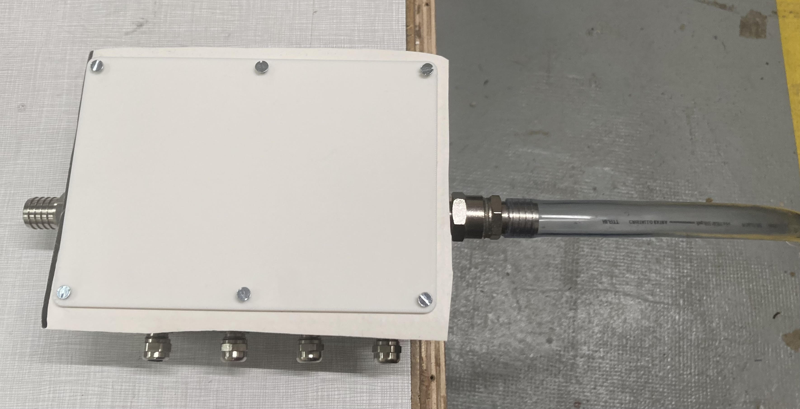

# ReadMe on how to design a metal box for 5 thermometers and 1 pressure sensor. 

## Materials : 

- Metalic box
- Screws (different shapes, sizes)
- Dremel 
- Tap-sizes
- Silicon glue
- Weight
- Cover and seal 

## Protocol : 

### Step 1 : 

Draw the spots where to make the holes. Here are the dimensions : 

- On the widest faces : 
    - Face 1 : $4.5 cm$ from the bottom, first spot at $2 cm$ from the left, then $4.1 cm$ 3 times and then it should be remaining $2 cm$ from the edge.
    - Face 3 : $4.5 cm$ from the bottom, a unique spot at $10 cm$ from the left, which should be $6.5 cm$ from the edge.

- On the narrowest faces : 
    - Faces 2 & 4 (same) : $4.5 cm$ from the bottom, a unique spot at $5.8 cm$ from the left.

### Step 2 : 

#### Holes for the thermometers and the pressure sensor : 

Pre-drill holes with the Dremel using two different drill bit sizes: the smallest one first, then the next size up. Next, use the drill and drill by hand to enlarge the pre-drilled holes. Finally, tap with the three different taps—sizes to deepen the holes. 

### Step 3 : 

Screw the different screws with silicon in the spots and wait until it is dry. 

### Step 4 : the cover 
Because we want to communicate between the sensor in the box in the riverbed and the relay, we need to have a cover which material let electromagnetic waves to pass through. Therefore, we want to print it with 3D printing. You can find the 3D printing file in the document 'cover.stl'. One of the issue is to make sure water does not go through the cover and doesn't enter the box, therefore we use a seal (see step 6). 

Here is the picture of the cover and the seal with the screws :

### Step 5 

Glue a weight on the bottom of the metal box, so it doesn't float when put in the river. 

### Step 6 : Finalize 

Cut a piece of seal which is a little bit bigger than the cover and after filling the box with all the components of the MOLONARI1D device that goes inside, screw the printed cover on top of the seal with little screws. It is better to use screws that has flat top in order to prevent corrosion when the box is left a long time in the river. 

## Picture of the finished box

