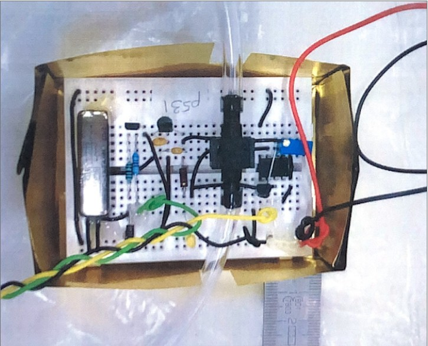

# Building the differential pressure sensor

The building scheme is found in the image 'Circuit_scheme_credit_Greswell.jpg'

The main component is a piezo resistive membrane, which reference is "Pressure sensor Honeywell 26PC series". 

The differential pressure sensor measures the pressure thanks to a piezo resistive membrane, through a variable resistance in a Wheatstone bridge, which is sensitive to mechanical deformation. Indeed, the membrane deforms under pressure, as it is related to the underground water (at 40cm depth) and to the river's water. The deformation is then converted into an electric signal and the sensor measures a voltage. 

The equation and parameters linking voltage and pressure are described in the '\calibration' folder. 

The membrane of the pressure sensor is powered by a 9V battery (or 6 batteries of 1.5V each), as the Wheatstone bridge needs a lot of energy. 

Here is a picture of a differential pressure sensor : 

