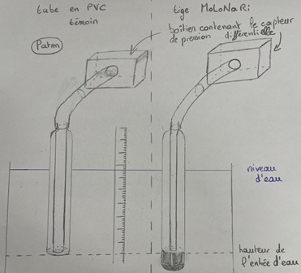
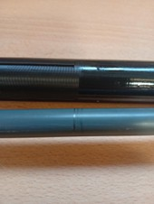
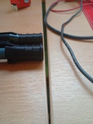

# Calcul des pertes de charges 

## Étude théorique de la tige, perte de charges 

Nous avons souhaité évaluer les pertes/gains de charge dans la tige en régime stationnaire dûes à des forces de tension superficielles causées par la finesse du rayon de notre tube et du rayon des trous que l’on a percés. 
Nous basons notre évaluation en modélisant la tige ainsi que les trous du bas de la tige par des tubes de purin afin de calculer les pertes de charges selon la formule : 
$ h = \frac{2*(\gamma)*cos(\theta)}{(\rho)*g*h} $ où $\gamma$ est le coefficient de tension superficiel de notre matériau au contact de l’eau (ici $\gamma$ = 40N.m-1 en comparaison avec d’autres coefficients de matériaux de même nature [1]), $\theta$ est l’angle de mouillage de l’ASA en contact avec l’eau (ici $\theta$ = 87°C [2]). 

Nous considérons, étant donné que les effets de tension superficielle sont inversement proportionnels au rayon de l’ouverture, que nous majorons la perte de charge générée par un tube de rayon ayant celui de l’ouverture la plus petite que l’on permet dans notre tige. 
Le rayon intérieur de la tige est de 4mm, celui de l’ouverture (au bas de la tige) qui laisse l’eau s’infiltrer est de 0.5mm.
L’application numérique de ce calcul nous donne pour le rayon d’infiltration, en notant h la perte de charge : $h = 7mm$, soit moins d’1% de la charge de l’eau au bas de la tige en statique (c’est à dire sans compter d’éventuels flux de la nappe vers la rivière ou inversement). 

## Test expérimental de pertes de charges 

Afin de vérifier cette hypothèse théorique, très incertaine en raison de la difficulté d’obtenir plusieurs sources différentes donnant des valeurs classiques d’angle de mouillage ou de coefficient de tension superficielle de l’ASA nous avons mis au point un protocole expérimental afin d’évaluer en direct les pertes de charges.
L’idée est d’utiliser un tuyau en silicone, de 40cm, dont le rayon est tel que les pertes de charges en son sein sont négligeables par rapport à celles générées par la fente de notre tige. Il s’agit alors de voir pour nos deux tiges fixées à la même hauteur au niveau de l’ouverture en bas, quelle différence de charge on observe. D’après l’étude théorique, on devrait avoir moins de 7mm de différence entre les deux tubes. 

### Schéma explicatif : 
On branche les deux tiges aux deux cotés de notre capteur de pression précédemment étalonné. La différence de potentiel lue sur le data-loger nous permet de remonter à la charge selon la formule affine (à 17°C, température de l’eau lors de l’experience) : 
$$dH = 168.13*U - 235.47$$ où $U$ est la tension.

Coupe de la tige en silicone pour obtenir la même taille (soit la même charge de l’eau au niveau de l’ouverture).

### Résultat de nos expériences.

Imprécision en charge du capteur : 

Charge pour le tube en silicone de test supposé parfait : 20m

Charge pour notre tube : 20,05m soit 5mm de pertes de charges en pratique, ce qui est acceptable au vu de la charge classique étudiée : (40m environ)

[1] : Table de données de coefficients. https://www.technibond.co.uk/wp-content/uploads/2019/04/surface-energy-chart.pdf?utm_source=chatgpt.com

[2] : Valeur angle de mouillage de l’ASA avec l’eau. https://www.researchgate.net/figure/Contact-angle-and-density-values-of-PVC-ASA-PVC-ASA-and-PVC-ASA-o-MMT-nanocomposites_fig5_342502428

