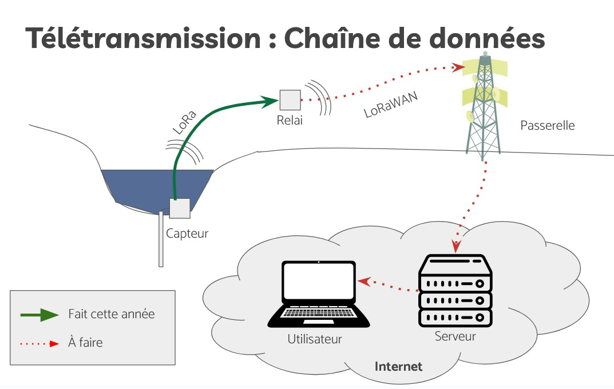

# Notre protocole LoRa

## Intro

On s'intéresse à la communication entre le capteur et le relai (la flèche en vert sur le schéma). Le principal objectif est de transmettre les mesures faites par le capteur. (Même si à terme on pourrait avoir d'autres flux d'infos)

 

On transmet les données par radio en utilisant la technologie LoRa. Elle permet une communication sans fil sur des longues distances, et ce avec peu de consommation d'énergie. C'est donc parfait pour notre cas.  

Pour info, le LoRaWAN est un protocole qui permet à un objet LoRa de transmettre des données vers internet, en passant par une "passerelle". On n'a pas implémenté la partie LoRaWAN, mais on a réflechi à faire un protocole qui puisse être adapté à LoRaWAN.

## Les difficultés

L'objectif du protocole LoRa est de transmettre les données de mesures, en apportant des garanties : il faut absolument que les données soient transmises sans erreur, et qu'on ne perde aucune mesure.

Les problèmes à corriger sont :
- Parfois les paquets n'arrivent pas
- Parfois ils arrivent en double
- Parfois ils sont eronnés (et n'ont même pas forcément la même taille)

En plus de ça on a des contraintes :
- Avec LoRa on ne peut émettre que 1% du temps
- Avec le LoraWAN on ne peut émettre que 30s par jour, et on a un nombre limité de requêtes descendantes (d'internet vers l'Arduino)  

## Solutions

### Pour le problème de paquets qui n'arrivent pas
Pour résoudre ce problème, le relai va demander les données en précisant le numéro de la première mesure qu'il lui manque. Comme ça, si jamais il y a un problème et que le paquet n'arrive pas, le relai le re-demandera la prochaine fois.  
Cette idée d'avoir le relai qui demande les données au capteur sera le mode de fonctionnement de la communication quoi qu'il arrive, y compris quand les paquets arrivent sans problème.  
Une conséquence de ce mode de fonctionnement, c'est que le capteur doit stocker les mesures qu'il fait. En effet, au moment où il les envoie il ne sait pas si la transmission s'est bien passée. Il le saura à la prochaine requête, si on lui demande d'autres mesures c'est que celles d'avant ont bien été reçues.

### Pour les problèmes de paquets qui arrivent en double
Chaque paquet est numéroté. Si on reçoit deux fois d'affilée le même numéro, il suffit d'ignorer le deuxième.

### Pour les paquets éronnés
On utilise une `CRC` : il y a des données en plus qui servent à vérifier l'integrité du paquet. Et s'il y a une erreur, le paquet est rejeté et on se ramène au cas où le paquet n'a pas été reçu.  
Implémentation : Il suffit d'activer l'option dans la librairie `Lora`, et les paquets seront automatiquement vérifiés et rejetés au besoin.

## Implémentation

### Format d'un paquet :
- Identifiant de l'émetteur (`uint8_t`) : Qui a émis le paquet
- Identifiant du destinataire (`uint8_t`) : A qui est destiné le paquet
- Numéro du paquet (`uint8_t`) : Le numéro unique de ce paquet (pour repérer les doublons)
- Le type de la requête (`uin8_t`) : A quelle action correspond ce paquet (envoyer des données / en demander / quelles données)
- Les données (dépend selon les cas)

NB : `uint8_t` signifie un entier non signé (toujours positif) sur 8 bit. Ses valeurs vont de 0 à 255.

### Types de requêtes 

Un  type de requête désigne un numéro pour identifier l'action à laquelle correspond une requête.  
Par exemple : demander une mesure

Les types de requête actuellement implantés :
 - **Demande de mesures** : `DT_REQ` (*data request*)  
    Le relai l'envoie au capteur pour lui demander de lui envoyer des mesures.  
    Données :
    - Le numéro de la première mesure manquante (`uint32_t`)
 - **Envoi de mesures** : `DT_RPL` (*data reply*)  
    Réponse à `DT_REQ`. Le capteur envoie une mesure au relai. Ce paquet pourra être répété plusieurs fois pour envoyer plusieurs mesures d'un coup.  
    Données :
    - Une mesure (de type `Measure` défini dans [internals/Measure.hpp](../Riviere_2023/internals/Measure.hpp))  

NB : Le type `Measure` contient la tension sur les 4 canaux (par exmeple les 4 températures), la date et l'heure de la mesure, et le numéro de la mesure.  

On associe un numéro à chaque type de requête :
| Nom | Numéro (hexadécimal) |
|-----|--------|
| DT_REQ | 0x01 |
| DT_RPL | 0x81 |

Le type RequestType est implémenté dans [internals/Lora.hpp](../Riviere_2023/internals/Lora.hpp)  

