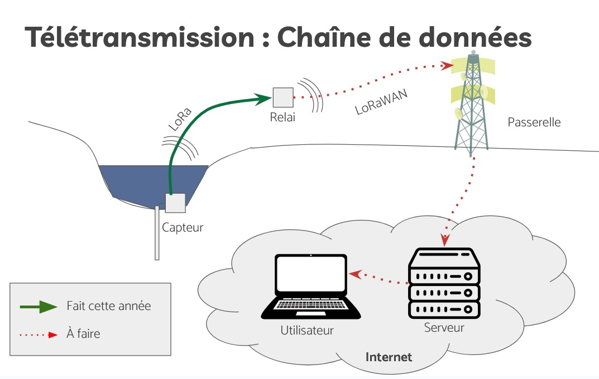

# Our LoRa Protocol

## Introduction

We focus on the communication between the sensor and the relay (the green arrow in the diagram). The main objective is to transmit the measurements made by the sensor, although eventually, we might have other data flows.

Data is transmitted via radio using LoRa technology. It enables wireless communication over long distances with low energy consumption, making it ideal for our needs.

For reference, LoRaWAN is a protocol that allows a LoRa device to transmit data to the internet through a "gateway." We have not implemented the LoRaWAN part, but we have considered designing a protocol that could be adapted to LoRaWAN.

## Challenges

The goal of the LoRa protocol is to transmit measurement data with certain guarantees: the data must be transmitted without errors, and no measurement should be lost.

The problems to address are:
- Sometimes packets do not arrive.
- Sometimes they arrive duplicated.
- Sometimes they are corrupted (and might not even have the same size).

In addition, we have constraints:
- With LoRa, we can only transmit 1% of the time.
- With LoRaWAN, we can only transmit for 30 seconds per day and have a limited number of downlink requests (from the internet to the Arduino).

## Solutions

### For the problem of missing packets
To solve this issue, the relay will request data by specifying the number of the first missing measurement. This way, if a problem occurs and the packet does not arrive, the relay will request it again the next time.  
This idea of having the relay request data from the sensor will be the communication mode regardless of whether packets arrive correctly.  
A consequence of this mode is that the sensor must store the measurements it takes. At the time of transmission, it does not know if the transmission was successful. It will find out with the next request—if it is asked for other measurements, it means the previous ones were successfully received.

### For the problem of duplicate packets
Each packet is numbered. If we receive the same number twice in a row, we simply ignore the second one.

### For corrupted packets
We use a `CRC` (Cyclic Redundancy Check): it includes additional data used to verify the integrity of the packet. If there is an error, the packet is discarded, treating it as if it had not been received.  
Implementation: You just need to activate the option in the `LoRa` library, and the packets will be automatically checked and discarded if needed.

## Implementation

### Packet Format:
- Sender ID (`uint8_t`): Who sent the packet.
- Recipient ID (`uint8_t`): Who the packet is intended for.
- Packet number (`uint8_t`): The unique number of this packet (to detect duplicates).
- Request type (`uint8_t`): The action corresponding to this packet (send data/request data/which data).
- The data (varies depending on the case).

Note: `uint8_t` means an unsigned integer (always positive) of 8 bits. Its values range from 0 to 255.

### Types of Requests

A request type refers to a number used to identify the action corresponding to a request.  
For example: requesting a measurement.

Currently implemented request types:
 - **Measurement Request**: `DT_REQ` (*data request*)  
    The relay sends this to the sensor to request measurements.  
    Data:
    - The number of the first missing measurement (`uint32_t`).
 - **Measurement Transmission**: `DT_RPL` (*data reply*)  
    Response to `DT_REQ`. The sensor sends a measurement to the relay. This packet can be repeated several times to send multiple measurements at once.  
    Data:
    - A measurement (of type `Measure` defined in [internals/Measure.hpp](../Riviere_2023/internals/Measure.hpp)).  

Note: The `Measure` type includes the voltage on 4 channels (for example, the 4 temperatures), the date and time of the measurement, and the measurement number.

Each request type is assigned a number:
| Name  | Number (Hexadecimal) |
|-------|----------------------|
| DT_REQ | 0x01                |
| DT_RPL | 0x81                |

The `RequestType` is implemented in [internals/Lora.hpp](../Riviere_2023/internals/Lora.hpp).  
