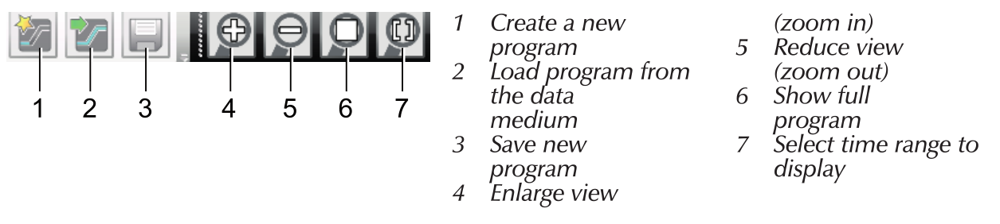
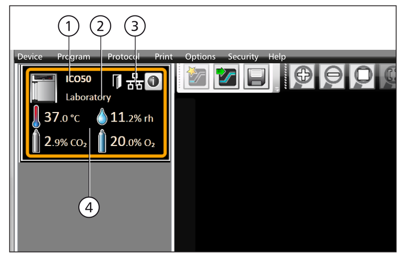
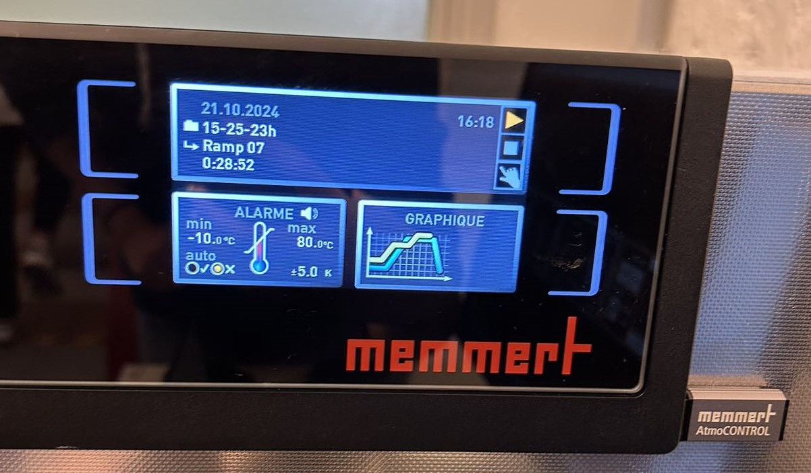

# Climate Chamber Userguide

---

## 1. Introduction
With AtmoCONTROL, you can graphically create, modify, and save programs with various parameters on the computer and transfer these programs to the climate chamber using a USB disk.

## 2. Working with AtmoCONTROL
Since we use the computer in zoom V003 at MINES, the following operations are based on the assumption that the AtmoCONTROL software has been installed and the AtmoCONTROL FDA device license has been successfully set up.

### 2.1 Starting AtmoCONTROL
First, unlock the computer using the MINES email address. The AtmoCONTROL program is available on the desktop (or in the Start menu). It does not allow multiple Windows users to operate on the same computer in parallel. **The student account may have limited usage rights, such as being unable to set temperature parameters.** (Aurélien mentioned that we can use his account temporarily, and he will apply for permissions for us.)

### 2.2 Program Interface

1 Menu bar 
2 Toolbar 
3 Status bar 
4 Signature bar
5 Show/hide status bar
6 Editor, simulation and protocol window 
7 Programming mode switch

#### 2.2.1 Menu bar

#### 2.2.2 Toolbar

#### 2.2.3 Status bar
The status bar gives an overview of the appliances logged on to AtmoCONTROL. Appliances can be added and removed again.

If the appliance is connected to the computer via Ethernet and it has already been logged on once, it is automatically recognised and the current operating state (temperature, alarms) is displayed.

Look at this exemple. (1)An appliance of type ICO50; (2) named “Laboratory”; (3) by the user, is registered via Ethernet; 
(4) current operating status in AtmoCONTROL.

### 2.3 Program
In the Editor window, programs can be created: sequences of various parameters (e.g. temperature, pressure and humidity), which the appliance then implements from a definable point in time.

To be able to create a program in AtmoCONTROL, the appliance which is to perform the program must be listed in the status bar and selected. The appliance can, but does not have to, be connected to the computer via the network. 

Select the appliance that will later perform the program by clicking on it in the status bar. An icon bar with the available parameters for this appliance is shown. Additionally, one or two editor threads are displayed, depending on the appliance. The program sequence is determined on these. Two editor threads are always shown for appliances with humidity or pressure control (3 and 4), and one editor thread for all others.

**Bear in mind that the two editor threads are not synchronised.** This means that a specific X position on one thread does not match the same position on the other thread in time. If you want to see the parameter values for a specific point in time, you must change to the simulation mode. While creating the program, you can display the prospective progression of all parameters as a diagram at any time. To do this, click on "Simulation" (see 5 in the image of the part 2.2)

#### 2.3.1 Create a program

**To create a program, just drag the individual parameter icons onto the editor thread one after another in the desired order**, while holding down the left mouse button. It's easy! To remove a parameter icon from an editor thread, select it and, with the mouse button depressed, move it to the recycle bin symbol on the lower right. 

#### 2.3.2 Parameters
If a parameter icon is clicked on an editor thread, it is displayed with an orange frame. The adjustable values – in the example, the ramp name, the duration and the temperature – have a grey background. 

For simulations with constant parameters, 1 represents the duration and 2 the parameter value. In the window on the right that can be displayed and folded, you can edit the tolerance band. We usually set it to the minimum value. Below it is the indicator light on the climate chamber, it is suggested to turn the safe indicator "on".
\

For time-varying parameters, the only difference is that the right window shows SPWT, which means the setpoint wait. If this is “on”, the program sequence is not continued before the setpoint value is reached, even if the set time has already expired. If this is “off”, the program sequence is continued after the set time has expired, irrespective of whether the setpoint value was reached or not. 

It is worth mentioning that for unknown reasons, we found that if the value of the first stable temperature is not set, the subsequent temperatures will automatically start from 20℃. Therefore, it is recommended to set a stable temperature of at least 5 minutes.

These are some other available parameters in the icon bar. Take the sinus curve as an exemple, we usually use an ascending straight line, a straight line parallel to the x-axis, and a descending straight line to simulate it.

#### 2.3.3 Saving
Here we only introduce the way to transfer a program via USB. Click Program -- Export to USB drive. The program is saved on the USB storage medium connected. Then connect the USB data medium to the appliance which is to run the program.

#### 2.3.4 Loading and running the program
A brief introduction to the climate chamber:

1 Touch to select
2 Return to the main menu
3 You can either turn it to select or press the middle to decide
4 USB

To load the program, you should first touch the "MENU" to go into the "PROG". Then turn the button 3 and press to select your program exported. Once you have selected it, turn the button 3 and press the middle to run it. It's over! Just wait.

The above user guide is not complete. If you have other needs, please refer to https://www.memmert.be/wp-content/uploads/2019/10/AtmoCONTROL-.pdf

### 2.4 Parameters to simulate a day
We use the function $T=-a\sin{\left(\frac{2\pi}{24}h\right)}+b$ to represent the way of daily temperature change in a region, with $a$ half of the daily temperature change and $b$ the average temperature of a day.

We want to convert the sinus function into straight lines so that the climate chamber could work to simulate the daily change. We want to form the shape of a trapezoid with the same area as the sinus function, as shown in the picture below. 

Here we take the slope the same as the deviation of the function at the point $h=0$, and the height of the trapezoid as $2a$ so we could easily achieve the goal. In the AtmoCONTROL_param program we made all the calculation in two parts. The first part of the program needs you to input your average temperature and the temperature difference. The second part of the program has the highest temprerature set at 25℃, and the lowest temperature varies with your input temperature difference. You could go there and input the situation you want to simulate and directly get the result as a shape of trapezoid, and set the AtmoCONTROL as being told.

## Why calibration

Before putting the sensors into river, one necessary thing is to correctly calibrate them, because for the same data, different calibration parameters leads to completely different results. Here are porosity results of 4 different calibration sets calculated by méthode inversion.

## How to calibrate the pressure sensor

Above image is the pressure sensor we use. We first keep temperature stable and change the pressure by adding water into each of the two tubes at different heights. And we obtain a fitting line between pressure and the tension measured.

Measurement of tension is also affected by temperature,as there’s is a phase difference between tension and temperature. We need to eliminate the influence of temperature on the pressure. So we will keep pressure stable and change the temperature by using the climate chamber.

The temperature change within 24 hours usually follows a sinusoidal curve fluctuation.However, the climate chamber can only program a straight line, so it is necessary to calculate the temperature and duration of each stage of rising, steady and falling. We write a program. Input delta T max you'll get the above data.

## Experiment in climate chamber

We developed a program using the software **AtmoCONTROL** (check AtomCONTROL_userguide.md for detailed information) and conducted simulations in a climate chamber. By varying the maximum temperature difference, we obtained several sets of data for the ambient temperature and sensor temperature, and plotted them to reveal a linear relationship. 

$$\phi=-0.342x+61.05$$

At this point, the maximum temperature difference was treated as a fixed constant.

## Validation of the Phase Difference Formula with fixed maximum temperature difference

To test the validity of our formula, we wrote a Python program. The red line in the plot represents the simulated temperature change curve inside the climate chamber, while the green line shows the actual temperature curve of the sensor. These two lines represent the real data. The blue line, on the other hand, is the sensor temperature curve simulated using the phase difference formula we derived.

As seen in the plot, the simulated blue curve aligns well with the actual data, confirming that the phase difference formula is valid.

## Illustration of phase difference

The phase difference is clearly visible in the plot. It means that, at time 𝑛, the sensor temperature corresponds to the external temperature at time 𝑛−𝜙, where 𝜙 is the phase difference.

## Identifying the Relationship Between Phase Difference and Local Temperature Change Rate (real environment)

In real-world environments, we observed that the maximum temperature difference is not a fixed value. To better handle data from real-world conditions, we explored the relationship between the phase difference 𝜙 and the **local temperature change rate**. By fitting four different data sets, we established a linear relationship that is applicable to the specific sensor system under study.
The phase difference fomula is written as follows:

$$\phi=-156.64\frac{\partial T}{\partial t}+61.05$$

## Voltage and Temperature Relationship

To find the relationship between voltage and temperature, we plotted the data obtained from the climate chamber experiments. The resulting curve approximates a parallelogram. However, an issue arose: the same external temperature corresponds to two different voltage values. This discrepancy is due to the phase difference, which introduces a delay in the system's response.

After eliminating the phase difference, we expect the voltage and sensor temperature to follow a linear relationship. To achieve this, we derived a correction formula that removes the influence of the phase difference. This formula is written as follows:

$$U_{n} = T_{\text{ext}}^{n-\phi}$$

Where $U_n$ represents the voltage at time $n$, and $T_{\text{ext}}^{n-\phi}$ represents the external temperature at time $n - \phi$.

## Combination of previous equations

By combining previous equations, we relate the voltage at time $n$ to the external temperature at time $n - \phi$. Using a reference temperature of 25°C, we calculated the temperature difference $\Delta T_{\text{ext}}^{n-\phi}$ and the voltage difference $\Delta U_n$, leading to a correction formula that accounts for the phase shift:

$$\Delta U_n = \alpha \cdot \Delta T_{\text{ext}}^{n - \phi}$$

This allows us to correct for the phase difference and derive the corrected voltage at the reference temperature.

$$\boxed{
    \begin{aligned}
    & U_c=U_n-\alpha \cdot \Delta T_{\text{ext}}^{n - \phi}\\
    & \phi=-156.64\frac{\partial T}{\partial t}+61.05 \\
    & a=-0.002 \\
    \end{aligned}
}$$

## Verification of the Corrected Formula

To verify the correction formula, we applied it to the experimental data obtained from the climate chamber. The corrected result is shown below. As demonstrated, the correction formula effectively mitigates the influence of temperature on the pressure sensor’s output. This confirms that our approach successfully compensates for temperature-induced errors and provides a reliable method for processing real-world data.

## Conclusion

The findings from our simulations and the verification of the phase difference formula allow us to confidently process data from temperature sensors in varying environmental conditions. By considering the phase difference and its impact on sensor readings, we developed a correction formula that removes the effect of temperature on the sensor output. This method provides a robust framework for accurately interpreting sensor data in both controlled and real-world environments, ensuring more precise measurements for applications where temperature fluctuation is a concern.

