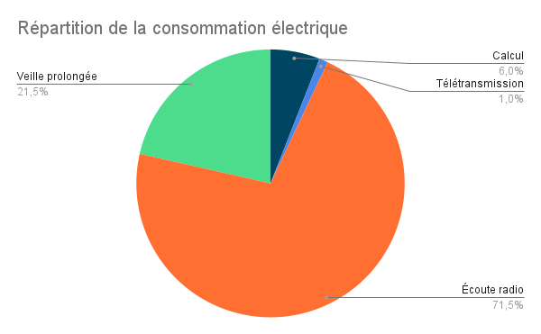

# Mesures de courant de l'électronique

## Intro
L'objectif de ce test est :
- De déterminer les solutions appropriées pour réduire la consommation de notre dispositif
- De calculer la consommation d'un cycle de mesure, et donc prédire la durée de vie sur batterie du capteur ou de relai.


## Expériences menées

### Protocole expérimental
Dans ces expériences, on met un programme sur une arrduino MKR WAN 1310 (celle avec les cables soudés dessus). Ensuite on la débranche de l'ordinateur, et on l'alimente sur batterie (celle avec les cables soudés dessus). Enfin on mesure le courant passant par le cable `+` de la batterie grace à un ampèremètre.

L'essai "transmission radio" est la seule exception : on remplace l'ampèremètre par une résistance de 1 
$\Omega$, et on mesure la tension aux bornes de cette résistance avec un oscilloscope.

Pour les expériences avec le montage complet, on utilise les branchements ci-dessous, **sans les sondes**.  


### Liste des expériences menées :

| Programme utilisé      |   Effet du programme   |
|:-:    |:-:  |
|**Programme avec juste la carte et l'antenne** |
| Idle    |  La carte arduino reste allumée et le processeur fait des calculs dans le vide    |
| Sleep   |  On met la carte directement en mode `LowPower.sleep`    |
| Ecoute radio |  On allume la radio et on la met en mode receive, avec le processeur en mode sleep   |
| Radio Idle|  On allume la radio et on la met en mode idle, avec le processeur en mode sleep |
| Radio off | On allume la radio puis on lance `LoRa.end()`, et on met le processeur en mode sleep  |
| Radio reset v1 | Idem en mettant le pin `LORA_RESET` à `LOW` |
| Radio reset Pin Pulldown | On met tous les pins en mode input pulldown |
| Radio reset Pin Pullup | On met tous les pins en mode input pullup |
| Radio reset v2 (version actuelle) | On met `LORA_RESET` à `LOW` puis à `HIGH` |
| Transmission Radio | On émet un message LoRa et on mesure la consommation avec un oscilloscope |
| **Programme sur montage complet** |
|  Main + Extension deep sleep + reset | Programme rivière 2023 : initalisation puis reset radio(v2) puis on met le processeur en mode sleep : on obtient la conso de la carte d'extension |
| Deep sleep + Extension off | On a mis le programme sleep en ayant branché les extensions (on mesure la conso des extensions non alumées) |
| Deep sleep + extension avec SD débranchée | même expérience mais avec carte SD débranchée |


## Résultat des mesures
| Programme utilisé      |   Consommation de courant    |
|:-:    |:-:  |
|**Programme avec juste la carte et l'antenne** |
| Idle    |    10 mA   |
| Sleep   |   0.106 mA   |
| Ecoute radio |  20 mA   |
| Radio Idle|  10.6 mA |
| Radio off |  9 mA |
| Radio reset v1 | 0.40 mA |
| Radio reset Pin Pulldown | 0.40 mA --> 5 mA (fluctuations) |
| Radio reset Pin Pullup| 0.40 mA --> 4.6 mA (fluctuations) |
| Radio reset v2 (version actuelle) | 0.107 mA |
| Transmission radio | 125 mA pendant 35 ms|
| **Programme sur montage complet** |
|  Main + Extensions + deep sleep + LoRa reset | 30 mA (à vérifier, le résultat nous surprend) |
| Deep sleep + Extension off |  1 mA |
| Deep sleep + extension avec SD débranchée | 0.1 mA |


## Interprétation des résultats

### Consommation du processeur
Essai correspondant : *Idle*  
Lorsque le processeur est dans une boucle infinie, il consomme 10 mA.
On pourra considère que le processeur consomme toujours autant quand il fonctionne, quelles que soient les opérations qu'il exécute. Dans ce cas, on peut calculer sa consommation simplement à partir du temps de calcul.

### Consommation du processeur en veille
Essai correspondant : *Sleep*  
La méthode `LowPower.deepSleep()` fonctionne comme prévu, et réduit la consommation de l'arduino en elle-même à 0,1 mA.

### Consommation du module LoRa à l'arrêt
Essai correspondant : *Radio reset v2*  
En plus d'appeler `LoRa.end()`, il faut aussi réinitialiser le module.
Ainsi, le code pour éteindre le module LoRa est :
``` C++
LoRa.end();

pinMode(LORA_RESET, OUTPUT);
digitalWrite(LORA_RESET, LOW);
delay(10);
digitalWrite(LORA_RESET, HIGH);
pinMode(LORA_RESET, INPUT);
```
La consommation du module LoRa est alors nulle.

### Consommation de l'écoute LoRa
Essai correspondant : *Ecoute radio*  
Ecouter les messages LoRa un coût énergétique important de 20 mA, soit 200 fois plus qu'en veille.  
**Il n'est donc pas envisageable de maintenir ce mode activé en continu.**  
Pour pallier à ce problème, il faudra implémenter des [fenêtres d'écoute](../Documentation%202023/Fenetre%20d'écoute.md).

### Consommation de la transmission LoRa
Essai correspondant : *Transmission radio*  
C'est la phase où l'intensité est la plus élevée.  
Néanmoins, cette consommation pourra être négligée dans le calcul de la consommation moyenne car elle est d'extrêmement courte durée.  
Attention : Cette mesure a été faite avec le processeur éteint. Il faudra essayer de faire la même chose lors de l'implémentation. C'est a priori possible si on utilise le pin LORA_IRQ comme source d'interruption pour sortir du mode d'écoute.  
Exemple :
```c++
// Whether a packet has been received during the deep-sleep.
bool hasReceivedPacket;

// Put the
void LowPowerLoraReceive(uint32_t timeout) {

  hasReceivedPacket = false;

  // Setup the lora listening phase.
  LowPower.attachInterruptWakeup(RADIO_IRQ, WakeUpLora, RISING);
  LoRa.receive();

  // Wait either until a packet is received, or the timeout is reached
  LowPower.deepSleep(timeout);

  // Exit the lora listening phase.
  LowPower.detachInterruptWakeup(RADIO_IRQ);
  LoRa.end();
  // TODO : Reset the LoRa module
  
  if (hasReceivedPacket) {
    // TODO : Read the packet and react to it
  }
}

void OnLoraIrq() {
  // Do not read the packet in that function, as it would be too long of an operation during an interrupt.
  hasReceivedPacket = true;
}
```

### Consommation de la carte SD
Essai correspondant : *Extensions actives* et *Extensions inactives*

La carte SD amène à une importante consommation d'énergie. Même si elle n'a jamais été allumée, elle consomme 1 mA. (d'après "*Extensions inactives*")  
Si elle a été allumée, elle consomme 30 mA en continu (d'après "*Extensions actives*", à vérifier, ça nous paraît beaucoup). Il n'y a pas de fonction dans la librairie SD qui nous permette d'éteindre la carte SD. Donc si on active la carte, on se retrouve avec une consommation de 30 mA que l'on ne peut pas arrêter.

Pour se passer de cette consommation, il faudrait : 
- Soit se débarasser de la carte SD (voir [notre avis sur la carte SD](../Documentation%202023/Retour%20SD.md))
- Soit avoir un système pour couper l'alimentation de la carte SD.  
(Attention : il ne suffit pas de mettre l'entrée 3V de la carte SD sur un pin IO de l'Arduino, car ceux-ci ne peuvent débiter que 7 mA)

## Analyse de la consommation du capteur
Faisons une étude de faisabilité pour savoir si le capteur pourra tenirr 3 mois sur batterie.

Pour que le capteur soit viable, il faudrait que sa consommation moyenne sur un cycle soit au plus de l'ordre du mA. Il suffirait alors d'une batterie de quelques Ah pour faire une mission de 3 mois.

Cet objectif semble réalisable, surtout quand on considère que l'Arduino (MKR WAN) ne consomme que 0,1 mA en veille.  

### Cycle considéré
Chaque cycle est constitué de :  
- 15 min de veille  
- 1 s de mesures, calculs et enregistrement sur la carte SD, approximée à 1s de calculs  
- 10 s d'écoute radio  
- 35 ms de transmission radio

On part du principe que la consommation des sondes et de la carte SD sont nuls en veille. On peut alors les négliger sur un cycle, en effet ils ne seront allumés que quelques secondes toutes les 15 min.

Comme on ne connaît pas encore les temps de calculs et d'écoute radio, on les a majoré. Le temps de calcul sera très probablement inférieur à 1s. Et le temps d'écoute radio pourrait probablement être réduit à ~2 s.  

### Résultats
Dans le cycle considéré, le système consomme **en moyenne 0,5 mA**. Cela lui permet de tenir 3 mois sur une batterie de 1 Ah.

On obtient alors la répartition suivante :  


On note que le principal poste de dépense est l'écoute radio. Il sera d'autant plus important d'optimiser cette partie.

## Conclusion

Le résultat de l'étude de faisabilité est optimiste ! Il devrait être possible de faire un capteur qui tienne 3 mois sur batterie.

Il ne reste plus qu'à implémenter le mode basse énergie en pratique.

Taches à faire pour garantir une faible consommation :
- Implémenter le mode de veille dans le code [Riviere 2023](../Riviere_2023/Riviere_2023.ino)
    - Vérifier que cela ne casse pas les autres fonctionnalités
    - Le temps en `millis()` cesse de s'écouler pendant la veille (à vérifier). Il faudra vérifier que ça ne casse rien, et remplacer `millis()` par une utilisation de la RTC dans les autres cas. 
- Réduire le temps passé en mode "écoute radio", en implémentant les fenêtres d'écoute
- Trouver une solution pour réduire la consommation de la carte SD
- Vérifier que la consommation des capteurs est bien négligeable sur un cycle 