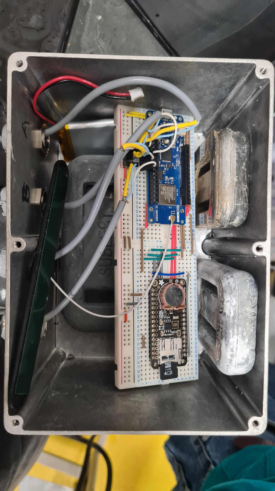

# LE tuto de mise en place d'un capteur MOLONARI

## 1. Prérequis

### 1.0. Avant-ça

Pour réaliser cette mise en place, il vous faudra un diplôme en physique nucléaire OU (exclusif) deux mains fonctionnelles (minimum une)(ou des pieds).

### 1.1. Matériel

- [Arduino MKR WAN 1310](https://docs.arduino.cc/hardware/mkr-wan-1310) (récupération des données + envoi par LoRa)
- [Antenne Waterproof](https://store.arduino.cc/products/dipole-pentaband-waterproof-antenna) (à brancher sur la MKR WAN 1310)
- [Module Adalogger Featherwing SD- RTC](https://www.adafruit.com/product/2922) (à brancher selon la notice ci-après)
- Des cables Micro USB - USB ou des bateries (pour alimenter les cartes). Remarque : la connection en USB permet l'alimentation et la communication avec l'ordinateur (pour le code, et le port Serial). Elle permet aussi de charger une batterie qui serait connectée à la MKR WAN

### 1.2. Logiciels

- [Arduino IDE](https://www.arduino.cc/en/software)
- [Visual Studio Code](https://code.visualstudio.com/) (conseillé)

Sur Arduino IDE, il faut s'assurer d'avoir installé les librairies suivantes :

- ``Arduino Low Power`` (Mise en veille profonde)
- ``FlashStorage`` (Stockage de données dans la mémoire flash)
- ``LoRa`` (Communication LoRa)
- ``RTCLib`` (Gestion de l'horloge temps réel externe)
- ``RTCZero`` (Gestion de l'horloge temps réel interne à la MKR WAN 1310)
- ``SD`` (Communication carte SD)

## 2. Branchements

Pour les branchements, il est très fortement conseillé de le faire sur une bread board (en l'occurence 2 assemblées entre elles) pour avoir des connections très propres et s'assurer que ce n'est pas la cause de pourquoi ça marche pas.

Par *branchements* nous entendons les connections électriques entre la *MKR WAN 1310* (A) et l'*Adalogger Featherwing* (B) (SD + RTC), ainsi qu'avec les capteurs. Pour plus de clarté vous pouvez retrouver les *pinouts* (= cartographies des pins d'une carte) aux liens suivant :

- [Pinout MKR WAN 1310](https://docs.arduino.cc/hardware/mkr-wan-1310) → "Pinout +"
- [Pinout Featherwing](https://learn.adafruit.com/adafruit-adalogger-featherwing/pinouts) 

Il est intéressant de remarquer que les pins qui ne seront pas utilisés sur la Featherwing sont inutiles et surtout **connectés à rien**. Donc vous pouvez faire passer des cables sur les lignes de la breadboard associées à ces pins (qui n'en sont pas).

### 2.1. La partie alimentation

Il faut s'assurer que l'alimentation de la batterie aille bien jusqu'à la *Featherwing*. Cela revient à connecter, comme indiqué sur le *schéma 1* :

* les masses (GND). Il est recommandé de réserver une ligne du board des breads bords pour l'utilisation d'une masse commune (c'est une pratique courante qui facilite le cablage et sa révision)
* le pin VCC (A) au port 3.3V (B). Même remarque que pour la masse : réservez une ligne entière

### 2.2. La partie SD

Là, il y a 4 paires de pins à connecter pour assurer la communication:

* Le pins CS choisi sur (A) (on avait pris le 5)* au pin SDCS (B)
* Les 3 pins suivants (ils assurent la communication SPI) attention c'est très technique:
  * (A) SCK - SCK (B)
  * (A) MOSI - MOSI (B)
  * (A) MISO - MISO (B)

**<u>remarque :</u>* Le pin CS sur (A) est "libre", il faut dans tous les cas qu'il coincide au "`const int CSPin`" apparaissant dans le fichier `Riviere.ino` (Cf plus loin). Il ne faut PAS prendre le pin 6. La raison est toute bête : il est directement connecté à la LED built_in de la carte, et elle va s'allumer à chaque fois que vous allez communiquer avec le module SD, et c'est ce qui va consommer le plus : à fuir.

### 2.3. La partie RTC

Pour la RTC, il y a 2 fils à tirer :

*   (A) SCL - SCL (B)
*   (A) SDA - SDA (B)

### 2.4. Les capteurs

Cette partie s'applique pour les capteurs de températures (tige avec 4 thermistances). Si vous mettez un capteur différentiel (pour la pression) il faudra se rensigner. Sinon pour la partie température, la sortie du cable de chaque capteur se compose en 3 parties :

* Le cable jaune → masse (GND)
* Le cable bleu → alimentation 3.3V (VCC)
* le cable blanc → pin de la board (on avait pris A1, A2, A3 et A4)

## 3 Le code à insérer dans les cartes.

Il va falloir se munir d'un cable *USB - Micro USB* connecté avec un ordinateur muni d'Arduino IDE et du code à insérer. **Très important :** il faut que le fichier principal du code (dans notre cas `Rivière.ino`) soit dans un dossier qui porte **le même nom** (c'est comme ça c'est la vie).

### 3.1. Code capteur (dans la rivière)

Avant d'upload le code, il faut s'assurer que les pins (CSPin et les pins capteurs) coincident avec ce qu'il se passe en vrai, sinon il va vous arriver la pire chose qu'il peut arriver à quelqu'un qui fait ce genre de choses : le code compile et ça marche quand même pas...

Après c'est Upload (le bouton avec la flèche). Si il ne trouve pas le port COM alors que c'est branché, il faut appuyer deux fois sur les boutons resets des deux cartes (en même temps). Ensuite, il faut ressélectionner le port COM à droite du bouton upload. Si après ça, ça marche toujours pas : google et bon courage :)

### 3.2. Code relais (sur la rive)

C'est tout pareil, mais en prenant le bon code. Simple non ?

## Heuuu pourquoi ça marche paaas ?

Alors là... courage.

* S'assurer des bons branchements (et des contacts avec un multimètre)
* S'assurer que les cartes sont bien alimentées (eh oui)
* Regarder le code et s'assurer que le processeur n'est pas tombé dans une boucle infinie typiquement un "`while (!Serial) {}`".
* Au début, il est conseillé de faire un max de test avec un ordi (qui alimente la carte en USB) avec une connection en Serial, qui permet d'afficher des trucs dans le terminal. C'est le pendant du print() en Python, et ça s'appelle `Serial.println()` (le `Serial.print()` fait la même chose mais sans retour à la ligne)
* Si ça a avoir avec la carte SD, on vous avait prévenu dans `retour SD.md`...
* Si même après avoir tout vérifié et exorcisé par un prêtre homologué ça ne marche toujours pas, il vous reste toujours la solution de l'envoûtement quantique...

## 2. Branchements

Pour les branchements, il est très fortement conseillé de le faire sur une bread board (en l'occurence 2 assemblées entre elles) pour avoir des connections très propres et s'assurer que ce n'est pas la cause de pourquoi ça marche pas.

Par *branchements* nous entendons les connections électriques entre la *MKR WAN 1310* (A) et l'*Adalogger Featherwing* (B) (SD + RTC), ainsi qu'avec les capteurs. Pour plus de clarté vous pouvez retrouver les *pinouts* (= cartographies des pins d'une carte) aux liens suivant :

- [Pinout MKR WAN 1310](https://docs.arduino.cc/hardware/mkr-wan-1310) → "Pinout +"
- [Pinout Featherwing](https://learn.adafruit.com/adafruit-adalogger-featherwing/pinouts) 

Il est intéressant de remarquer que les pins qui ne seront pas utilisés sur la Featherwing sont inutiles et surtout **connectés à rien**. Donc vous pouvez faire passer des cables sur les lignes de la breadboard associées à ces pins (qui n'en sont pas).

Chaque étape est détaillée après, mais voici un schéma qui résume tout ça :

### 2.1. La partie alimentation

Il faut s'assurer que l'alimentation de la batterie aille bien jusqu'à la *Featherwing*. Cela revient à connecter, comme indiqué sur le *schéma 1* :

* les masses (GND). Il est recommandé de réserver une ligne du board des breads bords pour l'utilisation d'une masse commune (c'est une pratique courante qui facilite le cablage et sa révision)
* le pin VCC (A) au port 3.3V (B). Même remarque que pour la masse : réservez une ligne entière

### 2.2. La partie SD

Là, il y a 4 paires de pins à connecter pour assurer la communication:

* Le pins CS choisi sur (A) (on avait pris le 5)* au pin SDCS (B)
* Les 3 pins suivants (ils assurent la communication SPI) attention c'est très technique:
  * (A) SCK - SCK (B)
  * (A) MOSI - MOSI (B)
  * (A) MISO - MISO (B)

**<u>remarque :</u>* Le pin CS sur (A) est "libre", il faut dans tous les cas qu'il coincide au "`const int CSPin`" apparaissant dans le fichier `Riviere.ino` (Cf plus loin). Il ne faut PAS prendre le pin 6. La raison est toute bête : il est directement connecté à la LED built_in de la carte, et elle va s'allumer à chaque fois que vous allez communiquer avec le module SD, et c'est ce qui va consommer le plus : à fuir.

### 2.3. La partie RTC

Pour la RTC, il y a 2 fils à tirer :

*   (A) SCL - SCL (B)
*   (A) SDA - SDA (B)

### 2.4. Les capteurs

Cette partie s'applique pour les capteurs de températures (tige avec 4 thermistances). Si vous mettez un capteur différentiel (pour la pression) il faudra se rensigner. Sinon pour la partie température, la sortie du cable de chaque capteur se compose en 3 parties :

* Le cable jaune → masse (GND)
* Le cable bleu → alimentation 3.3V (VCC)
* le cable blanc → pin de la board (on avait pris A1, A2, A3 et A4)

## 3 Chargement du code

Il va falloir se munir d'un cable *USB - Micro USB* connecté avec un ordinateur muni d'Arduino IDE et du code à insérer. **Très important :** il faut que le fichier principal du code soit dans un dossier qui porte **le même nom** (c'est comme ça c'est la vie).

### 3.1. Code capteur (dans la rivière)

Pour le capteur, c'est le code `Riviere_2023.ino` qui est à charger.

Avant d'upload le code, il faut s'assurer que les pins (CSPin et les pins capteurs) coincident avec ce qu'il se passe en vrai, sinon il va vous arriver la pire chose qu'il peut arriver à quelqu'un qui fait ce genre de choses : le code compile et ça marche quand même pas...

Après, c'est Upload (le bouton avec la flèche). Si il ne trouve pas le port COM alors que c'est branché, il faut appuyer deux fois sur les boutons resets des deux cartes (en même temps). Ensuite, il faut ressélectionner le port COM à droite du bouton upload. Si après ça, ça marche toujours pas : google et bon courage :)

### 3.2. Code relais (sur la rive)

C'est tout pareil, mais en prenant `Rive_2023.ino`. Simple non ?

## 4 Mise en place

Cette partie est utile si vous souhaitez faire une démo de l'ensemble capteur - relais. Elle n'est pas nécessaire si vous voulez juste tester le capteur (le cas échéant il sera juste branché en USB à l'ordi).

### 4.1. Côté émetteur

Mettre le capteur sous tension avec une batterie. Passer les câbles de la sonde de température dans les passes-câbles (dévisser le capot, rentrer les câbles, revisser le capot pour l'étanchéité) voir la photo plus loin pour avoir une idée.

**Attention :** L'étanchéité c'est primordial, donc veillez à bien serrer les vis des capots. MAIS, ne serrez pas trop fort les passes-câbles, au risque de déchirer le joint en silicone autour. 

Ça doit avoir cette tête :

Remettre le toit et le visser (fort) pour l'étanchéité (attention sur la photo les vis ne sont pas vissées)

### 4.2. Côté récepteur:

Mettre le relais connecté avec un ordi pour pouvoir avoir une connection en Serial. Il faut ensuite ouvrir le moniteur série (l'icône en haut à droite de l'IDE Arduino). Sinon, on avait fait un petit programme qui permet de visualiser les données en temps réel.

## Heuuu pourquoi ça marche paaas ?

Alors là... courage.

* S'assurer des bons branchements (et des contacts avec un multimètre)
* S'assurer que les cartes sont bien alimentées (eh oui)
* Regarder le code et s'assurer que le processeur n'est pas tombé dans une boucle infinie typiquement un "`while (!Serial) {}`".
* Au début, il est conseillé de faire un max de test avec un ordi (qui alimente la carte en USB) avec une connection en Serial, qui permet d'afficher des trucs dans le terminal. C'est le pendant du print() en Python, et ça s'appelle `Serial.println()` (le `Serial.print()` fait la même chose mais sans retour à la ligne)
* Si ça a avoir avec la carte SD, on vous avait prévenu dans `retour SD.md`...
* Si même après avoir tout vérifié et exorcisé par un prêtre homologué ça ne marche toujours pas, il vous reste toujours la solution de l'envoûtement quantique...