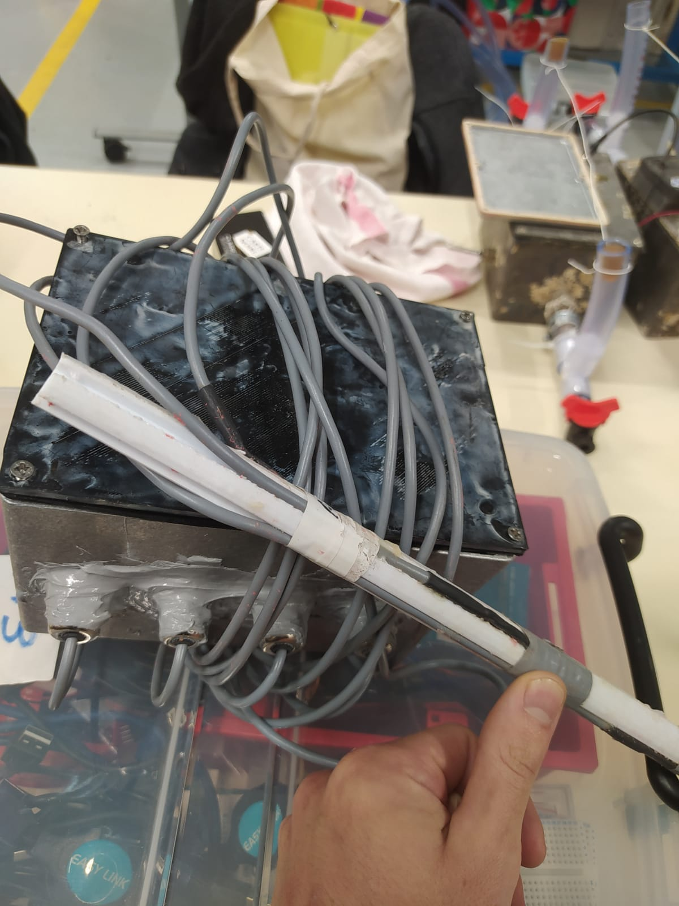

# LE tuto de mise en place d'un capteur MOLONARI

## 1. Prérequis

### 1.0. Avant-ça

Pour réaliser cette mise en place, il vous faudra un diplôme en physique nucléaire OU (exclusif) deux mains fonctionnelles (minimum une)(ou des pieds).

### 1.1. Matériel

- Deux [Arduino MKR WAN 1310](https://docs.arduino.cc/hardware/mkr-wan-1310) (récupération des données + envoi par LoRa)
- Deux [Antennes Waterproof](https://store.arduino.cc/products/dipole-pentaband-waterproof-antenna) (à brancher sur la MKR WAN 1310)
- Un [Module Adalogger Featherwing SD- RTC](https://www.adafruit.com/product/2922) (à brancher selon la notice ci-après)
- Des cables Micro USB - USB ou des bateries (pour alimenter les cartes). Remarque : la connection en USB permet l'alimentation et la communication avec l'ordinateur (pour le code, et le port Serial). Elle permet aussi de charger une batterie qui serait connectée à la MKR WAN

### 1.2. Logiciels

- [Arduino IDE](https://www.arduino.cc/en/software)
- [Visual Studio Code](https://code.visualstudio.com/) (conseillé)

Sur Arduino IDE, il faut s'assurer d'avoir installé les librairies suivantes :

- ``Arduino Low Power`` (Mise en veille profonde)
- ``FlashStorage`` (Stockage de données dans la mémoire flash)
- ``LoRa`` (Communication LoRa)
- ``RTCLib`` (Gestion de l'horloge temps réel externe)
- ``RTCZero`` (Gestion de l'horloge temps réel interne à la MKR WAN 1310)
- ``SD`` (Communication carte SD)

## 2. Branchements

Pour les branchements, il est très fortement conseillé de le faire sur une bread board (en l'occurence 2 assemblées entre elles) pour avoir des connections très propres et ne pas avoir à vous demander tout le temps si ce ne sont pas vos  branchements qui causent les problèmes.

Par *branchements* nous entendons les connections électriques entre la *MKR WAN 1310* (A) et l'*Adalogger Featherwing* (B) (SD + RTC), ainsi qu'avec les capteurs. Pour plus de clarté vous pouvez retrouver les *pinouts* (= cartographies des pins d'une carte) aux liens suivant :

- [Pinout MKR WAN 1310](https://docs.arduino.cc/hardware/mkr-wan-1310) → "Pinout +"
- [Pinout Featherwing](https://learn.adafruit.com/adafruit-adalogger-featherwing/pinouts) 

Il est intéressant de remarquer que les pins qui ne seront pas utilisés sur la Featherwing sont inutiles et surtout **connectés à rien**. Donc vous pouvez faire passer des cables sur les lignes de la breadboard associées à ces pins (qui n'en sont pas).

### 2.1. La partie alimentation

Il faut s'assurer que l'alimentation de la batterie aille bien jusqu'à la *Featherwing*. Cela revient à connecter, comme indiqué sur le *schéma 1* :

* les masses (GND). Il est recommandé de réserver une ligne du board des breads bords pour l'utilisation d'une masse commune (c'est une pratique courante qui facilite le cablage et sa révision)
* le pin VCC (A) au port 3.3V (B). Même remarque que pour la masse : réservez une ligne entière

### 2.2. La partie SD

Là, il y a 4 paires de pins à connecter pour assurer la communication:

* Le pins CS choisi sur (A) (on avait pris le 5)* au pin SDCS (B)
* Les 3 pins suivants (ils assurent la communication SPI) attention c'est très technique:
  * (A) SCK - SCK (B)
  * (A) MOSI - MOSI (B)
  * (A) MISO - MISO (B)

**<u>Remarque :</u>** Le pin CS sur (A) est au choix, il faut dans tous les cas qu'il coincide au "`const int CSPin`" apparaissant dans le fichier [Riviere_2023.ino](../Riviere_2023.ino) (Cf plus loin). Il ne faut PAS prendre le pin 6. La raison est toute bête : il est directement connecté à la LED built-in de la carte, et elle va s'allumer à chaque fois que vous allez communiquer avec le module SD, et c'est ce qui va consommer le plus.

### 2.3. La partie RTC

Pour la RTC, il y a 2 fils à tirer :

*   (A) SCL - SCL (B)
*   (A) SDA - SDA (B)

Pour résumer, à cette étape vous devriez avoir ce schéma électrique :

### 2.4. Les capteurs

Cette partie s'applique pour les capteurs de températures (tige avec 4 thermistances). Si vous mettez un capteur différentiel (pour la pression) il faudra se rensigner. Sinon pour la partie température, la sortie du cable de chaque capteur se compose en 3 parties :

* Le cable jaune → masse (GND)
* Le cable bleu → alimentation 3.3V (VCC)
* le cable blanc → pin de la board (on avait pris A1, A2, A3 et A4)

**Alternative :**  
Pour économiser de l'énergie, on peut couper l'alimentation des capteurs lorsqu'on ne les utilise pas. C'est une fonctionnalité qui est déjà prévue dans le code. Pour ça il suffit de brancher le + de l'alimentation des capteurs (cable bleu) sur les pins 1, 2, 3 et 4.

## 3 Le code à insérer dans les cartes.

Il va falloir se munir d'un cable *USB - Micro USB* connecté avec un ordinateur muni d'Arduino IDE et du code à insérer.  
**Très important :** il faut que le fichier principal du code (dans notre cas [Riviere_2023.ino](../Riviere_2023.ino)) soit dans un dossier qui porte **le même nom** (c'est comme ça c'est la vie).

### 3.1. Code capteur (dans la rivière)

Avant d'upload le code, il faut s'assurer que les pins (CSPin et les pins capteurs) coincident avec ce qu'il se passe en vrai, sinon il va vous arriver la pire chose qu'il peut arriver à quelqu'un qui fait ce genre de choses : le code compile et ça marche quand même pas...

Après c'est Upload (le bouton avec la flèche). Si il ne trouve pas le port COM alors que c'est branché, il faut appuyer deux fois sur les boutons resets de la carte qui n'apparaît pas. Ensuite, il faut re-sélectionner le port COM à droite du bouton upload. Si après ça, ça marche toujours pas : google et bon courage :)

### 3.2. Code relais (sur la rive)

C'est tout pareil, mais en prenant le bon code ([Rive_2023.ino](../../Rive_2023/Rive_2023.ino)). Simple non ?

## 4 Finaliser

### 4.1 Côté émetteur :
Passez les câbles de la sonde de température dans les passes-câbles (dévissez le capot, rentrez les câbles, revissez le capot pour l'étanchéité). Voir la photo plus loin pour avoir une idée.  
Mettez du lest au fond de la boite pour éviter qu'elle flotte. Prévoyez au moins 2~3 kg.

Ça doit avoir cette tête :

Ensuite il faut **supprimer tous les fichiers de la carte SD** puis l'insérer dans l'Adalogger. Il ne reste plus qu'à brancher l'antenne et la batterie.  

Si tout se passe bien, la LED orange devrait s'allumer et s'éteindre. Elle s'allume dès que le programme démarre, et s'éteint quand il a réussi à s'initialiser correctement. Si la LED ne s'éteint pas c'est probablement à cause d'un problème de carte SD.  
NB : c'est normal que la LED verte ne s'allume pas quand l'Arduino est sur batterie, les fabriquants ont fait ça pour éviter de gacher de la puissance.

Remettez le toit et vissez le (fort) pour l'étanchéité (attention sur la photo les vis ne sont pas vissées)  
*Je vous conseille de faire cette partie seulement dans un second temps, après avoir fait un essai de toute l'électronique.*

### 4.2 Côté récepteur :

Branchez l'antenne à l'arduino, et branchez l'arduino à un ordinateur en USB. Sur l'ordinateur, ouvrez un logiciel qui va lire ce que l'arduino envoit sur le port Serial. (Par exemple le `Serial Monitor` d'`Arduino IDE`)  
Là aussi, si tout se passe bien la LED orange devrait s'allumer puis s'éteindre. Si elle ne s'éteint pas, c'est probablement parce qu'il n'y a aucun logiciel qui se connecte sur le port Serial sur l'ordinateur.  

Options supplémentaires :  
- **Courbe sur l'Arduino IDE** : Si vous voulez que les données apparaissent sur une courbe, reliez le `pin 1` de à `VCC` (+3V) sur l'Arduino réceptrice, et lancez le `Serial Plotter` d'`Arduino IDE`.
- **Mode avec mémoire** : Actuellement, quand on redémarre le récepteur il re-demande toutes les mesures du capteur, même  celles qu'il avait déjà demandé avant d'être éteint. Si vous voulez qu'il reprenne là où il s'était arrêté, reliez le `pin 0` du récepteur à `VCC` (+3V). (Si vous videz le contenu de la carte SD, il faudra réinitialiser la mémoire du récepteur on débranchant le pin 0)

## Heuuu pourquoi ça marche paaas ?

Alors là... courage.

* S'assurer des bons branchements (et des contacts avec un multimètre)
* S'assurer que la LED des Arduino s'allument puis s'éteignent. Si elles ne s'allument pas c'est qu'elles n'ont pas de courant, si elles ne s'éteignent pas c'est que l'initialisation a raté. Si l'initialisation du capteur ne finit jamais, c'est la carte SD qui est responsable dans 99% des cas. Si ça arrive avec le relai, c'est qu'il n'est as branché à un ordinateur, ou que l'ordinateur n'a aucun logiciel qui écoute le port Serial.
* Au début, il est conseillé de faire un max de test avec un ordi (qui alimente la carte en USB) avec une connection en Serial, qui permet d'afficher des trucs dans le terminal. C'est le pendant du print() en Python, et ça s'appelle `Serial.println()` (le `Serial.print()` fait la même chose mais sans retour à la ligne). Si vous voulez avoir une avalanche de commentaires dans la console pour comprendre ce qu'il se passe, on l'a prévu dans le code. Il suffit de dé-commenter la ligne `#define DEBUG` au début de [Riviere_2023.ino](../Riviere_2023.ino) et de [Rive_023.ino](../../Rive_2023/Rive_2023.ino), et de remettre le programme sur les Arduino.
* Il y a des chances que la carte SD vous pose des problèmes, il arrive souvent qu'elle arrête de marcher de manière aléatoire. Quelques pistes si ça arrive :
  - Réinitialiser l'Arduino avec le bouton reset
  - Enlever la carte SD, souffler dessus et la remettre
  - Effacer tous les fichiers de la carte SD
  - Tout ça en même temps
* On a remarqué que le relai fonctionne mieux quand il est aussi alimenté par batterie, même s'il est aussi relié en USB. Peut-être que notre cable avait un faux-contact.
* Si même après avoir tout vérifié et exorcisé par un prêtre homologué ça ne marche toujours pas, il vous reste toujours la solution de l'envoûtement quantique...